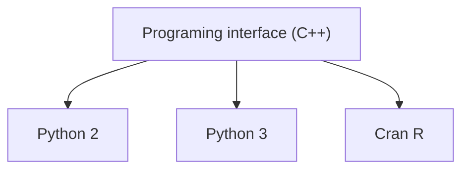

---
# Title, summary, and page position.
linktitle: The basics
summary: Learn what FMT is, and what it does.
weight: 1
icon: play
icon_pack: fas

# Page metadata.
title: The basics
date: "2018-09-09T00:00:00Z"
type: book  # Do not modify.
---

## What is FMT ?

In its most basic form, FMT is an open-source library of functions and objects that you can use in different programming langages : C++, R or Python.

The functions and objects of FMT are used to do **forest planning**. Forest planning answers the question of **how a forested landscape should be treated in order to maximize certain objectives** (e.g. economic return), **under certain constraints** (e.g. ecological and conservation objectives, legislation, operational limitations, etc.).

Concretely, FMT allows you to :

- **Read forest planning models** based on the Woodstock file format (which are spatially referenced [type III linear programming models](https://faculty.washington.edu/toths/Publications/McDill_etal_M2.pdf))
- **Edit and tweak those forest planning models**
- **Solve those forest planning models** (i.e. generate a schedule of actions which maximize objectives and respect constraints)
- **Make the stand variables and optimized schedule *spatially explicit*** (i.e. mapping the forest operations on a map)

## What is it mainly used for ?

- Reading Woodstock models
- Simulating forests landscapes
- Optimizing/Re-optimizing the models
- Replanning (by using stochastic events)
- Resolving aggregation heuristics
- Plannification of harvest blocs

## How does it work technically ?

The source code of the functions in FMT is written in the [C++ langage](https://en.wikipedia.org/wiki/C%2B%2B).

However, it is made to be compiled into different libraries format that can be used in the Python and R langage.

## Why was it made ?

The FMT project started in 2017, at the Chief forester's office (BFEC) of Québec.

Because the BFEC used Woodstock models every day, there was a need to have replicable code allowing users to automatically read and edit Woodstock models files without using the graphical interface of Woodstock every time.

In 2018, the BFEC started to be interested in having a tool to quantify carbon stocks in the forests. The choosen tool ([GCBM](https://www.youtube.com/watch?v=xnJqNBIET7A)) made precise estimates of carbon stocks and fluxes, but it needed information about where and when cuts would be made in the forest landscape, according to different managed scenarios.

Because of this, a model was needed to transform the spatially referenced information of Woodstock models (which groups all forest of the same types accross the landscape) into spatially explicit information (which contains information for every precise location on a map).

From 2019 to today, many features were made to improve the performance of FMT, and its capacity to make re-plannification.

## What are the futur plans for FMT ?

- A user interface for certain functions usefull for BFEC analysts, and for its integration with GCBM
- Spatially explicit optimization (currently, the optimization is done at the spatially referenced level, and its results are then made spatially explicit with [heuristics](https://en.wikipedia.org/wiki/Heuristic))
- Better outputs to facilitate integration with other models or scripts

* * *

Now that you know so much about FMT, you'll have no trouble understanding how it works, and how to use it.

{}
FMT uses a model structure and inputs that are very similar to the Woodstock software by Remsoft.

**If you don't know anything about Woodstock models**, you should take some time to read about them before reading this documentation. You'll feel a bit lost if you don't.
{}

**Ready to start ?**

