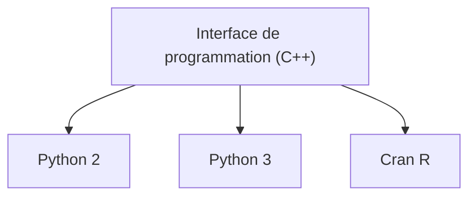

---
# Title, summary, and page position.
linktitle: Les bases de FMT
summary: Comprendre ce que FMT est, et ce qu'il fait.
weight: 1
icon: play
icon_pack: fas

# Page metadata.
title: Les bases de FMT
date: "2018-09-09T00:00:00Z"
type: book  # Do not modify.
---

## Qu'est-ce que FMT ?

Dans sa forme la plus basique, FMT est une librairie open source de fonctions et d'objets que vous pouvez utiliser dans différents langages de programmation: C++, R ou Python.

Les fonctions et les objets de FMT sont utilisés pour faire de la **planification forestière**. La planification forestière répond à la question de **comment un paysage forestier doit être traité afin de maximiser certains objectifs** (par exemple, le rendement économique), et **sous certaines contraintes** (par exemple, les objectifs écologiques et de conservation, la législation, les limites opérationnelles, etc.).

Concrètement, FMT vous permet de :

- **Lire les modèles de planification forestière** basés sur le format de fichiers Woodstock (qui sont des [modèles de programmation linéaire de type III](https://faculty.washington.edu/toths/Publications/McDill_etal_M2.pdf) référencés spatialement)
- **Modifier et modifier ces modèles de planification forestière**
- **Résoudre ces modèles de planification forestière** (c'est-à-dire générer un calendrier d'actions qui maximisent les objectifs et respectent les contraintes)
- **Rendre les variables de peuplements et le calendrier optimisé *spatialement explicites*** (c'est-à-dire cartographier les opérations forestières)

## À quoi sert-il principalement ?

- Lecture de modèles Woodstock
- Simulation de paysages forestiers
- Optimisation / Ré-optimisation de modèles
- Planification (en utilisant des événements stochastiques)
- Résolution des heuristiques d'agrégation
- Planification des blocs de récolte

## Comment est-ce que ça marche techniquement ?

Le code source des fonctions dans FMT est écrit dans le langage [C++](https://en.wikipedia.org/wiki/C%2B%2B).

Cependant, il est conçu pour être compilé dans différents formats de librairies de fonctions pouvant être utilisés en langage Python et R.

## Pourquoi a-t-il été concu ?

Le projet FMT a débuté en 2017, au Bureau du forestier en chef (BFEC) du Québec.

Étant donné que le BFEC utilisait des modèles Woodstock tous les jours, il était nécessaire d'avoir des scripts réplicables permettant aux analystes de lire et d'éditer automatiquement les fichiers de modèles Woodstock sans utiliser l'interface graphique de Woodstock à chaque fois.

En 2018, le BFEC a commencé à s'intéresser à un outil permettant de quantifier les stocks de carbone dans les forêts. L'outil choisi ([GCBM](https://www.youtube.com/watch?v=xnJqNBIET7A)) fait des estimations précises des stocks et des flux de carbone, mais il a besoin d'informations sur l'endroit et le moment des coupes dans le paysage forestier, selon différents scénarios d'aménagement forestier.

Pour cette raison, un modèle était nécessaire pour transformer les informations référencées spatialement des modèles de Woodstock (qui regroupent toutes les forêts du même type dans le paysage) en informations spatialement explicites (qui se trouvent à un emplacement précis sur une carte).

De 2019 à aujourd'hui, de nombreuses fonctionnalités ont été implémentées pour améliorer les performances de FMT, et sa capacité à faire de la replanification.

## Quels est le futur de FMT ?

- Une interface utilisateur.ice pour certaines fonctions utiles aux analystes du BFEC, et pour son intégration avec GCBM
- Optimisation spatialement explicite (actuellement, l'optimisation se fait au niveau spatialement référencé, et les résultats sont ensuite rendus spatialement explicites avec des [heuristiques](https://en.wikipedia.org/wiki/Heuristic))
- De meilleures sorties (*outputs*) pour faciliter son intégration avec d'autres modèles ou scripts

* * *

Maintenant que vous en savez tant sur FMT, vous n'aurez aucun mal à comprendre comment il fonctionne et comment l'utiliser.

{}
FMT utilise une structure de modèle et des entrées très similaires au logiciel Woodstock de Remsoft.

**Si vous ne connaissez rien aux modèles Woodstock**, vous devriez prendre le temps de lire à leur propos avant de lire cette documentation. Vous vous sentirez un peu perdu si vous ne le faites pas.
{}

**Prêt.e à commencer ?**

