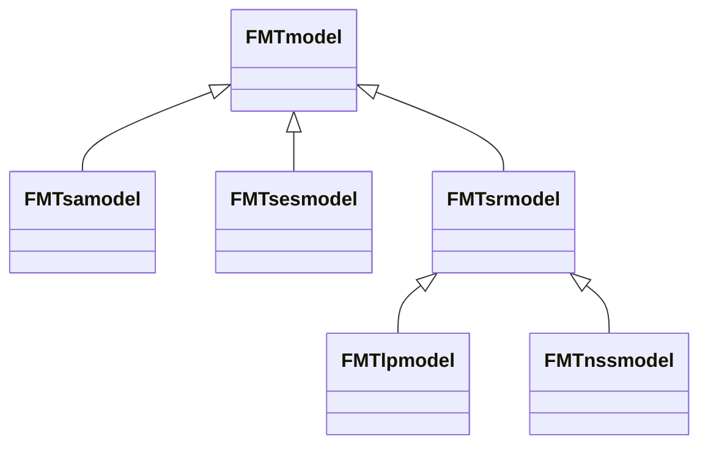

## Un petit rappel sur la signification de "spatialement référencé".

On peut distinguer 3 façons de prendre en compte l'espace dans un modèle :

- Dans un **modèle non spatial** ou **modèle spatialement implicite**, les entités (par exemple, les forêts, les animaux, les agents, etc.) ne sont pas directement associées à une position dans l'espace, mais la relation entre elles dans le modèle peut impliquer que seules certaines d'entre elles interagissent entre elles de manière à mimer une disposition spatiale.
- Dans un modèle **spatialement référencé**, les entités sont associées à des régions de l'espace, mais pas à une position précise dans ces régions ; ces régions peuvent être non-continues. Les modèles de Woodstock sont par nature spatialement référencés, car ils considèrent des *strates* qui correspondent à des forêts de même composition et de même âge, qui peuvent être dispersées en de nombreux endroits du paysage.
- Dans un modèle **spatialement explicite**, les entités sont associées à des coordonnées précises dans l'espace, comme dans les pixels d'une carte matricielle.

## Le `FMTsesmodel`

`FMTsesmodel` est un modèle particulier qui donne à l'utilisateur la possibilité de **spatialiser** les solutions provenant de n'importe quelle classe `FMTsrmodel`, qui sont les modèles spatialement référencés (voir [objets, lecture et interrogation de modèles](../objects_parsing_interrogation) et [optimisation spatiallement référencée](../spatially_referenced_optimization)).

Notez que **nous ne parlons pas de l'optimisation d'un modèle spatialement explicite** ; c'est une tâche assez complexe qui est encore sur le plan de route de FMT (et qui est le but de la classe `FMTsamodel`).



Au lieu de ca, le `FMTsesmodel` va essayer de spatialiser le calendrier d'un `FMTsrmodel` en plaçant des blocs de coupe sur une carte. Il fait cela en faisant des itérations dans lesquelles il simule le placement de ces blocs, et en sélectionnant la meilleure solution trouvée.

Pour utiliser une métaphore, cela revient à essayer de trouver une position gagnante aux échecs si vous n'êtes pas capable de la trouver en réfléchissant bien au placement de vos pièces d'échecs : vous pourriez essayer de placer vos pièces au hasard de nombreuses, nombreuses fois, et vous demander à chaque fois si vous avez gagné, ou si vous êtes plus proche de la victoire, et si la position des pièces d'échecs respecte les règles du jeu.

Ici, `FMTsesmodel` essaiera de placer les blocs de coupe selon la solution d'un `FMTsrmodel` (qui est un calendrier d'opérations forestières appliqué à des *strates* spatialement référencées). Son but sera de trouver le meilleur positionnement possible, en s'accommodant au mieux des contraintes linéaires et spatiales qui sont données pour leur placement, et en maximisant la valeur objective (par exemple, en maximisant le bois récolté).

Cependant, cette méthode a peu de chance de trouver le **placement optimal**, s'il existe ; à la place, plus il y a d'itérations pour essayer de les placer, plus il y a de chance de trouver une solution qui se rapproche le plus possible d'un placement optimal des blocs coupés dans l'espace. C'est pourquoi ce processus représente ce que nous appelons une [heuristique](https://en.wikipedia.org/wiki/Heuristic).

## L'espace dans FMT

FMT utilise des `FMTlayers` pour représenter toute solution spatialement explicite.

Un `FMTlayer` peut être comparé à un fichier raster ordinaire dans lequel les pixels peuvent contenir à peu près n'importe quel type ou classe de peuplement forestier.

Dans le `FMTsesmodel`, nous utilisons la classe `FMTspatialschedule` pour représenter une solution spatialement explicite, qui est elle-même une `FMTlayer` de `FMTlinegraph`.

Chaque `FMTlinegraph` est une version linéaire du `FMTgraph` décrit dans [optimisation spatiallement référencée](../spatially_referenced_optimization). Cela signifie qu'ils montrent l'évolution du `FMTdevelopment` à l'intérieur du pixel du début à la fin des périodes que nous voulons prendre en compte.

## La classe `FMTspatialschedule`.

La classe `FMTspatialschedule` contient une solution spatialement explicite sous la forme d'un `FMTlayer`. 

Elle contient une fonction importante, `FMTspatialschedule.getsolutionstatus()`, qui imprime des informations importantes sur la façon dont la solution contenue dans le `FMTspatialschedule` atteint l'objectif du modèle.

Cette fonction donne également une valeur de l'*infaisabilité primaire*, qui donne une idée de la mesure dans laquelle la solution actuelle ne respecte pas toutes les contraintes linéaires et spatiales du modèle.

Notez que contrairement à l'objet `FMTschedule` qui ne concerne qu'une seule période de temps (c'est pourquoi le code montré dans la section sur [l'optimisation spatialement référencée](../spatially_referenced_optimization) contenait une boucle `for` autour du nombre de périodes d'intérêt lorsqu'il s'agissait de la classe `FMTschedule`), `FMTspatialschedule` contient une solution pour plusieurs périodes de temps à la fois.

## Le `FMTlinegraph`

Comme dit précédemment, la structure spatiale d'un `FMTsesmodel` est comme une carte raster faite de pixels, chaque pixel étant un `FMTlinegraph`.

Dans un `FMTlinegraph`, chaque noeud représente l'état des strates à l'intérieur du pixel et chaque lien représente une action (par exemple une coupe totale) ou une croissance naturelle, comme le montre l'image suivante :



Cependant, contrairement à l'objet `FMTgraph` décrit dans la section sur [l'optimisation spatialement référencée](../spatially_referenced_optimization), le `FMTlinegraph` ne contient pas une énumération complète de toutes les actions et états possibles pour les strates dans le pixel : au lieu de cela, il ne contient qu'une solution, ou une évolution possible pour les strates.

## Faire des transitions avec des sorties uniques

Une limitation de la classe `FMTlinegraph` est que l'on ne peut pas utiliser de transitions à sorties multiples, c'est-à-dire des transitions qui aboutissent à deux strates ou d'autres sorties, comme illustré ci-dessous :



Par conséquent, **vous devrez modifier les transitions d'un `FMTmodel` pour pouvoir les utiliser dans un `FMTsesmodel`**.

À cette fin, vous pouvez utiliser la fonction `FMTtransition.single()`, qui transforme automatiquement les transitions à sorties multiples en transitions à sortie unique.

Une fois que les transitions ont été transformées en transitions uniques, vous pouvez utiliser la fonction `FMTsesmodel.settransitions()` pour intégrer les nouvelles transitions générées dans le `FMTsesmodel`.

## Événements spatiaux

Le `FMTspatialschedule` garde également la trace des zones affectées par des actions particulières sous la forme d'événements spatiaux avec la classe `FMTevent`, comme illustré ici :



`FMTevent` peut représenter tout type de perturbation spatialement explicite (coupe, feu, etc.). Il est associé à la période de temps de l'événement, et aux coordonnées de l'événement spatial.



## La carte forestière initiale

En tant que modèle spatialement explicite, le `FMTsesmodel` nécessite des informations spatialement explicites sur les forêts du paysage au début de l'horizon de planification.

Pour obtenir ces informations à partir d'un modèle Woodstock (qui peut avoir servi à créer un `FMTlpmodel` que vous avez optimisé ; voir [optimisation spatialement référencée](../spatially_referenced_optimization)), vous devrez récupérer ces informations à partir du fichier vectoriel qui sert de carte au modèle Woodstock. Ce fichier vectoriel contient des informations sur les attributs *theme*, *age* et *lock* pour chaque strate qui devront être transférées dans plusieurs rasters spatialement explicites.

Toutes ces informations seront contenues dans l'objet `FMTforest`, qui est l'équivalent de la carte du modèle, mais qui est basé sur un `FMTlayer`. Chaque pixel d'un objet `FMTforest` contient un objet `FMTactualdevelopment`.

La classe `FMTareaparser` peut être utilisée pour générer le `FMTforest` nécessaire au `FMTsesmodel`, car elle contient des fonctions pour lire les cartes vectorielles ou matricielles d'un modèle Woodstock.

- `FMTareaparser.vectormaptoFMTforest()` vous permet de lire une carte vectorielle (shapefile) existante
- `FMTareaparser.readrasters()` vous permet de lire des cartes raster existantes

Ces deux fonctions requièrent plusieurs paramètres pour identifier correctement les thèmes nécessaires, et pour spécifier plusieurs caractéristiques spatiales de la classe `FMTforest` que vous allez créer.

Une fois que la `FMTforest` est créée, elle doit être fournie au `FMTsesmodel` en utilisant la fonction `FMTsesmodel.setinitialmapping()`.

## Utilisation de nouveaux mots-clés dans les fichiers Woodstock pour les contraintes spatiales

Dans un modèle Woodstock habituel, les contraintes spatiales ne sont pas prises en compte. Cependant, vous aurez certainement besoin d'en utiliser pour une simulation spatiale avec le `FMTsesmodel`, afin de placer les blocs de coupe du planning optimisé.

A cette fin, FMT peut lire deux nouveaux mots-clés dans la section *optimize* d'un modèle Woodstock qui n'existent pas dans la syntaxe originale de Woodstock.

Ces mots-clés sont `_SIZE` et `_ADJACENCY`.

`_SIZE` doit être utilisé avec la syntaxe suivante dans la section *optimize* d'un modèle Woodstock :

``_SIZE(ACTION, NEIGHBORSIZE) >= <TAILLE EN PIXELS> <PÉRIODES>``

Notez que :

- `ACTION` peut également être un agrégat de plusieurs actions, de sorte que plusieurs actions peuvent être soumises à la même contrainte.
- `NEIGHBORSIZE` décrit comment l'événement spatial s'est propagé d'un pixel à un autre pixel, en suivant ce graphique :

- `<PERIODS>` correspondent à la période de temps pour laquelle il faut fixer la contrainte.

Ainsi, la contrainte `_SIZE` peut donner une taille minimale ou maximale pour les événements des actions spécifiées, en nombre de pixels contigus. Elle entraînera la création de *blocs* spatiaux de pixels où l'action a été appliquée.

Parallèlement, `_ADJACENCY` est utilisé avec la syntaxe suivante :

`_ADJACENCY(ACTION, GREENUP) >= <DISTANCE> <PÉRIODES>`.

Avec :

- `ACTION` peut à nouveau être un agrégat de plusieurs actions, de sorte que plusieurs actions peuvent être soumises à la même contrainte.
- `<PERIODS>` correspond à nouveau à la période de temps pour laquelle il faut fixer la contrainte.
- `DISTANCE` correspond à la distance d'adjacence minimale ou maximale entre deux blocs spatiaux d'une ou plusieurs actions (dont la taille a été définie par `_SIZE`). Ainsi, pour une `DISTANCE` >= 3, on aura ce qui suit :

- Les `GREENUP` correspondent au nombre de périodes de temps pour lesquelles nous considérons que deux événements sont voisins. Par exemple, si `GREENUP` est égal à 3, deux blocs spatiaux d'actions qui sont sous la distance maximale indiquée par `DISTANCE` mais qui sont séparés temporellement par 4 périodes ne seront pas considérés comme spatialement adjacents ; cependant, s'ils étaient séparés par 3, 2 ou 1 période, ou sont dans la même période, ils seront considérés comme spatialement adjacents.

## Faire la simulation avec `FMTsesmodel.Greedyreferencebuild()`

Une fois que vous avez une solution/ un calendrier spatialement référencé (voir [optimisation spatialement référencé](../spatially_referenced_optimization)) et que vous avez défini le paysage initial pour le `FMTsesmodel` (voir les sections précédentes), vous pouvez utiliser `FMTsesmodel.Greedyreferencebuild()` pour faire la simulation proprement dite, et obtenir un calendrier d'opérations spatialement explicite basée sur le calendrier d'opérations spatialement référencé.

`FMTsesmodel.Greedyreferencebuild()` a besoin de la solution spatialement référencée d'un `FMTlpmodel` (ou d'un `FMTnssmodel`), sous la forme d'un objet `FMTschedule`. Cette solution décrit quel développement (ou strates) est récolté pour une période donnée, avec quelle action, et sur quelle surface/zone.

Le `FMTschedule` d'un `FMTlpmodel` ou `FMTnssmodel` solutionné peut être récupéré en utilisant leur fonction `getsolution()`. Cependant, la fonction récupérera la solution pour une période ; vous devrez boucler autour des périodes pour obtenir les solutions pour chaque période d'intérêt, et pour indiquer si vous voulez que la solution prenne en compte les développements bloqués (*locked*).

`FMTsesmodel.Greedyreferencebuild()` construira une solution spatialement explicite à partir d'une solution spatialement référencée pour une période donnée. Avec le `FMTschedule` pour la période, la fonction aura besoin d'un argument `randomiterations` qui est le nombre maximal d'itérations faites par l'algorithme avant qu'il ne s'arrête quand aucune augmentation de la valeur de la fonction d'objectif (maximisation de l'objectif) ou diminution de la valeur d'infaisabilité primaire n'a été trouvée. Cela s'explique par le fait que la simulation est constituée d'itérations au cours desquelles le modèle tente de placer les blocs de coupe dans l'espace conformément au calendrier d'opérations spatialement référencé afin d'augmenter la fonction d'objectif du modèle (par exemple, le volume récolté) tout en respectant les contraintes linéaires et spatiales données (dont la déviation aux contraintes est représentée par la valeur d'infaisabilité primaire).

Une dernière entrée est un numéro de graine aléatoire (*seed*) qui sera utilisé pour générer des nombres aléatoires utilisés pour créer les blocs de coupe à chaque itération. Ce système de graine permet à FMT d'utiliser des nombres aléatoires qui sont "réplicables" ; c'est-à-dire que si vous gardez la même graine, FMT obtiendra les mêmes nombres aléatoires, et fera exactement les mêmes simulations.

Voici une représentation du fonctionnement de l'algorithme de simulation en pratique :



En R, le code pour utiliser `FMTsesmodel.Greedyreferencebuild()` ressemblera à ceci :

```R
library(FMT) # Charge FMT dans R
if (new(FMTversion)$hasfeature("OSI")) # Vérifie si FMT a été compilé avec OSI en créant un nouvel objet FMTversion, et en utilisant la fonction hasfeature().
{
	# Lit et résoud un FMTlpmodel; voir la section sur l'optimisation spatialement référencée pour plus de détails
	newparser <- new(FMTmodelparser)
	modelslist <- newmodelparser$readproject("Models/TWD_land/TWD_land.pri", c("Spatial"), TRUE, TRUE, TRUE)
	solverinterface <- list(CLP=1,MOSEK=2,CPLEX=3,GUROBI=4)
	lpmodel <- new(FMTlpmodel,modelslist[[1]],solverinterface$MOSEK)
	emptyschedule <- new(FMTschedule)
	for (period in 1:10)
	{
		print(lpmodel$buildperiod(emptyschedule,FALSE,1)$str())
	}
	allmodelconstraints <- lpmodel$getconstraints()
	modelobjective <- allmodelconstraints[[1]]
	modelconstraints <- allmodelconstraints[2:length(allmodelconstraints)]
	for (constraint in modelconstraints)
	{
		print(lpmodel$setconstraint(constraint)$str())
	}
	print(lpmodel$setobjective(modelobjective)$str())
	# Ici, on test si le modèle a été résolu tout en le résolvant, vu que initialsolve() résoud le modèle et renvoie "true" si il a été résolu
	if (lpmodel$initialsolve())
	{
		# On créer un nouveau modèle de simulation spatialement explicite, en se basant sur le contenu de lpmodel
		simulationmodel <- new(FMTsesmodel, lpmodel)
		# On fait en sorte que les transitions du modèle aient une seule sortie, et on les modifient si nécéssaires
		singletransition <- list()
		for (transition in simulationmodel$gettransitions())
		{
			# Le +1 est fait pour s'adapter au fait que FMT étant codé en C++, il fonctionne en base 0 (les listes commencet à l'indice 0); alors que R fonctionne en base 1.
			singletransitions[[length(singletransitions) + 1]] <- transition$single()
		}
		simulationmodel$settransitions(singletransitions)
		# On prépare un parseur pour lire la carte initiale des forêts
		areaparser <- new(FMTareaparser)
		# On définit où est-ce que le raster avec les informations initiales des forêts se trouvent
		rasterslocation <- "../Models/TWD_land/rasters"
		ageraster <- file.path(rasterlocation,"AGE.tif")
		# On lit les différents rasters qui contiennent les différents "themes" (ou attributs) initiaux des forêts en faisant
		# une boucle autour de tous les themes définits dans le modèle, et en mettant le nom de ces rasters dans une liste
		themesrasters <- list()
		themeid <- 1
		for (theme in simulationmodel$gethemes())
		{
			themesrasters[[length(themesrasters) + 1]] <- file.path(rasterslocation, paste("THEME", paste0(themeID), ".tif", sep = ""))
			themeid <- themeid + 1
		}
		# Maintenant que l'on a tous les rasters, on creer un object FMTforest en lisant tous les rasters de themes, qui contiennent les informations initiales des forêts
		initialforestmap <- areaparser$readrasters(simulationmodel$getthemes(), unlist(themerasters), ageraster, 1, 0.0001, "")
		# On donne les données initiales de forêt au modèle spatialement explicite
		simulationmodel$setinitialmapping(initialforestmap)
		# Maintenant, on trouve la solution spatialement explicite pour chaque période de temps,
		# en se basant sur la solution du lpmodel pour cette période.
		# On stoppera la recherche de l'algorithme lorsqu'il n'aura pas trouvé de meilleurs placements pour augmenter la fonction objectif
		# ou bien réduire l'infasibilité primaire pendant 10 itérations.
		for (period in 1:10)
		{
			print(simulationmodel$greedyreferencebuild(lpmodel$getsolution(period,FALSE), 10, 0, 0.0001))
		}

	}

} else { # Si le modèle n'as pas été compilé avec OSI, on affiche une erreur
	print("FMT needs to be compiled with OSI")
}
```

L'équivalent en Python est :

```python
import sys
from FMT import Models
from FMT import Parser
from FMT import Version

if __name__ == "__main__":
	if Version.FMTversion().hasfeature("OSI"):
		# Lit et résoud un FMTlpmodel; voir la section sur l'optimisation spatialement référencée pour plus de détails
		newmodelparser=  Parser.FMTmodelparser()
		path = "Models/TWD_Land/TWD_Land.pri"
		scenarios = ["Spatial"]
		modelslist = newmodelparser.readproject(path, scenarios)
		lpmodel = Models.FMTlpmodel(modelslist[0], Models.FMTsolverinterface.CLP)
		for period in range(1, 11):
			print(lpmodel.buildperiod())
		constraints = lpmodel.getconstraints()
		objective = constraints.pop(0)
		for constraint in constraints:
			lpmodel.setconstraint(constraint)
		lpmodel.setobjective(objective)
		# Ici, on test si le modèle a été résolu tout en le résolvant, vu que initialsolve() résoud le modèle et renvoie "true" si il a été résolu
		if lpmodel.initialsolve():
			# On créer un nouveau modèle de simulation spatialement explicite, en se basant sur le contenu de lpmodel
			simulationmodel = Models.FMTsesmodel(lpmodel)
			# On fait en sorte que les transitions du modèle aient une seule sortie, et on les modifient si nécéssaires
			singletransitions = []
			for transition in simulationmodel.gettransitions():
				singletransitions.append(transition.single())
			simulationmodel.settransitions(singletransitions)
			# On prépare un parseur pour lire la carte initiale des forêts
			areaparser = Parser.FMTareaparser()
			# On définit où est-ce que le raster avec les informations initiales des forêts se trouvent
			rasterslocation = "../Models/TWD_land/rasters/"
			ageraster = os.path.join(rasterslocation, "AGE.tif")
			# On lit les différents rasters qui contiennent les différents "themes" (ou attributs) initiaux des forêts en faisant
			# une boucle autour de tous les themes définits dans le modèle, et en mettant le nom de ces rasters dans une liste
			themesrasters = []
			themeid = 1
			for theme in simulationmodel.getthemes():
				themesrasters.append(os.path.join(rasterslocation, "THEME" + str(themeid) + ".tif"))
				themeid += 1
			# Maintenant que l'on a tous les rasters, on creer un object FMTforest en lisant tous les rasters de themes, qui contiennent les informations initiales des forêts
			initialforestmap = areaparser.readrasters(simulationmodel.getthemes(), themesrasters, ageraster, 1, 0.0001)
			# On donne les données initiales de forêt au modèle spatialement explicite
			simulationmodel.setinitialmapping(initialforestmap)
			# Maintenant, on trouve la solution spatialement explicite pour chaque période de temps,
			# en se basant sur la solution du lpmodel pour cette période.
			# On stoppera la recherche de l'algorithme lorsqu'il n'aura pas trouvé de meilleurs placements pour augmenter la fonction objectif
			# ou bien réduire l'infasibilité primaire pendant 10 itérations.
			for period in range(1, 11):
				print(simulationmodel.greedyreferencebuild(lpmodel.getsolution(period), 10))
	else:
		print("FMT needs to be compiled with OSI") # Si le modèle n'as pas été compilé avec OSI, on affiche une erreur
```

La sortie des deux codes devrait être la suivante. Il y a beaucoup de choses à traiter, mais nous les examinerons plus précisément dans la prochaine section :

```bash
Reading D:/TempCode/FMT/FMT/Examples/Models/TWD_land/TWD_Land.pri 
FMT 0.9.1, build: Oct 22 2021 11:52:53
Fri Feb 18 12:44:56 2022
Reading scenario Spatial
FMTexc(41)Ignoring: YBM_RTM_MEH at line 44 FMTsection(6)Yield
FMTexc(39)Undefined _death action: _DEATH FMTsection(4)Action
Done reading Fri Feb 18 12:44:56 2022
Columns: 69 Rows: 34 Vertices: 62 Edges: 69 Transfer Rows: 34 Output Rows: 0 Output Columns: 0
Columns: 173 Rows: 86 Vertices: 126 Edges: 173 Transfer Rows: 86 Output Rows: 0 Output Columns: 0
Columns: 320 Rows: 156 Vertices: 208 Edges: 320 Transfer Rows: 156 Output Rows: 0 Output Columns: 0
Columns: 510 Rows: 244 Vertices: 308 Edges: 510 Transfer Rows: 244 Output Rows: 0 Output Columns: 0
Columns: 730 Rows: 350 Vertices: 426 Edges: 730 Transfer Rows: 350 Output Rows: 0 Output Columns: 0
Columns: 986 Rows: 474 Vertices: 562 Edges: 986 Transfer Rows: 474 Output Rows: 0 Output Columns: 0
Columns: 1278 Rows: 616 Vertices: 716 Edges: 1278 Transfer Rows: 616 Output Rows: 0 Output Columns: 0
Columns: 1606 Rows: 776 Vertices: 888 Edges: 1606 Transfer Rows: 776 Output Rows: 0 Output Columns: 0
Columns: 1992 Rows: 964 Vertices: 1088 Edges: 1992 Transfer Rows: 964 Output Rows: 0 Output Columns: 0
Columns: 2436 Rows: 1180 Vertices: 1316 Edges: 2436 Transfer Rows: 1180 Output Rows: 0 Output Columns: 0
Coin0506I Presolve 76 (-1143) rows, 226 (-2211) columns and 898 (-5379) elements
Clp0035I 0 Primal 100 Dual 842632.63 Complementarity 842579 - 0 fixed, rank 76
Clp0035I 1 Primal 225.4735 Dual 307283.38 Complementarity 318751.96 - 0 fixed, rank 76
Clp0035I 2 Primal 7266.7264 Dual 146511.3 Complementarity 174120.63 - 0 fixed, rank 76
Clp0035I 3 Primal 35053.074 Dual 105622.03 Complementarity 73089.174 - 0 fixed, rank 76
Clp0035I 4 Primal 38320.846 Dual 70235.705 Complementarity 33405.695 - 0 fixed, rank 76
Clp0035I 5 Primal 44403.19 Dual 55792.68 Complementarity 11676.178 - 0 fixed, rank 76
Clp0035I 6 Primal 46801.335 Dual 50712.255 Complementarity 3964.085 - 0 fixed, rank 76
Clp0035I 7 Primal 47534.239 Dual 48865.81 Complementarity 1331.5805 - 0 fixed, rank 76
Clp0035I 8 Primal 47849.045 Dual 48152.188 Complementarity 303.14539 - 0 fixed, rank 76
Clp0035I 9 Primal 47959.375 Dual 48049.655 Complementarity 90.456075 - 0 fixed, rank 76
Clp0035I 10 Primal 47999.651 Dual 48009.843 Complementarity 10.204147 - 0 fixed, rank 76
Clp0035I 11 Primal 47998.773 Dual 48000.252 Complementarity 1.4873248 - 0 fixed, rank 76
Clp0035I 12 Primal 47999.994 Dual 48000.002 Complementarity 0.0085757189 - 0 fixed, rank 76
Clp0035I 13 Primal 48000 Dual 48000 Complementarity 0.00011127406 - 0 fixed, rank 70
Clp0035I 14 Primal 48000 Dual 48000 Complementarity 1.102542e-06 - 0 fixed, rank 63
Clp0035I 15 Primal 48000 Dual 48000.074 Complementarity 8.4407744e-09 - 20 fixed, rank 68
Clp0035I 16 Primal 48000 Dual 48000 Complementarity 6.8286544e-11 - 20 fixed, rank 65
Clp0042I Optimal
Clp0046I At end primal/dual infeasibilities 0.00015298276/0.10009623, complementarity gap 4.668539e-06, objective 48000
Clp0006I 0  Obj 48000 Dual inf 0.015282 (8)
Clp0006I 152  Obj 48000
Clp0000I Optimal - objective value 48000
Clp0006I 0  Obj 48000
Clp0000I Optimal - objective value 48000
Clp0006I 0  Obj 48000
Clp0000I Optimal - objective value 48000
Coin0511I After Postsolve, objective 48000, infeasibilities - dual 0 (0), primal 0 (0)
Clp0032I Optimal objective 48000 - 16 iterations time 0.022, Presolve 0.01
Iteration 0 Primal Inf(0.000000) Obj(40475.320000)
Iteration 10 Primal Inf(0.000000) Obj(44085.320000)
Stalled after 16 iterations Skipping
{'ACARIBOU': 0.981677543988014, 'COUPETOTALE': 0.9817026645791909, 'Objective': 42453.599999999984, 'Primalinfeasibility': 0.0, 'Total': 0.9816850800303768}
Iteration 0 Primal Inf(2310.400000) Obj(40143.200000)
Iteration 10 Primal Inf(216.600000) Obj(42237.000000)
Iteration 20 Primal Inf(0.000000) Obj(42453.600000)
Solution stuck after 30 iterations Skipping
{'ACARIBOU': 1.0278470194296387, 'COUPETOTALE': 0.9116104392588846, 'Objective': 42453.599999999984, 'PLANTATION': 0.927291117344956, 'Primalinfeasibility': 1.4551915228366852e-11, 'Total': 0.9264994202031354}
Iteration 0 Primal Inf(2108.240000) Obj(42453.600000)
Iteration 10 Primal Inf(2108.240000) Obj(42453.600000)
Iteration 20 Primal Inf(635.360000) Obj(42453.600000)
Solution stuck after 27 iterations Skipping
{'ACARIBOU': 0.8973831819756647, 'COUPETOTALE': 0.9033560325101042, 'Objective': 42453.599999999984, 'PLANTATION': 0.911737449703183, 'Primalinfeasibility': 635.3600000000297, 'Total': 0.9025186555019942}
Iteration 0 Primal Inf(8779.520000) Obj(42453.600000)
Iteration 10 Primal Inf(8779.520000) Obj(42453.600000)
Iteration 20 Primal Inf(808.640000) Obj(42453.600000)
Solution stuck after 29 iterations Skipping
{'ACARIBOU': 0.8771528754492212, 'COUPETOTALE': 0.889988896215573, 'Objective': 42453.599999999984, 'PLANTATION': 0.8765659747164727, 'Primalinfeasibility': 808.6400000000212, 'Total': 0.8822416209150494}
Iteration 0 Primal Inf(6931.200000) Obj(42453.600000)
Iteration 10 Primal Inf(6931.200000) Obj(42453.600000)
Iteration 20 Primal Inf(1111.880000) Obj(42453.600000)
Solution stuck after 30 iterations Skipping
{'ACARIBOU': 0.8952525436304627, 'COUPETOTALE': 0.88445, 'Objective': 42453.599999999984, 'PLANTATION': 0.9411700993142432, 'Primalinfeasibility': 1111.8800000000338, 'Total': 0.9032996680762417}
Iteration 0 Primal Inf(9342.680000) Obj(42453.600000)
Iteration 10 Primal Inf(3638.880000) Obj(42453.600000)
Iteration 20 Primal Inf(3638.880000) Obj(42453.600000)
Iteration 30 Primal Inf(3638.880000) Obj(42453.600000)
Solution stuck after 35 iterations Skipping
{'ACARIBOU': 968.4932690882329, 'COUPETOTALE': 0.9397466289394396, 'Objective': 42453.599999999984, 'PLANTATION': 2367.8747068875177, 'Primalinfeasibility': 3638.8800000000047, 'Total': 1.0649491134961293}
Iteration 0 Primal Inf(16606.000000) Obj(30309.560000)
Stalled after 9 iterations Skipping
{'ACARIBOU': 1.3474601235578203, 'COUPETOTALE': 0.9825519488602954, 'Objective': 32937.64000000001, 'PLANTATION': 1.0022853728788734, 'Primalinfeasibility': 13977.919999999998, 'Total': 1.0087375080393326}
Iteration 0 Primal Inf(119576.200000) Obj(32937.640000)
Iteration 10 Primal Inf(65859.400000) Obj(32937.640000)
Iteration 20 Primal Inf(39247.920000) Obj(32937.640000)
Solution stuck after 28 iterations Skipping
{'ACARIBOU': 1054.0980891170655, 'COUPETOTALE': 0.845845565618348, 'Objective': 32937.64000000001, 'PLANTATION': 0.9266686936638757, 'Primalinfeasibility': 39247.9200000001, 'Total': 0.8969889215263215}
Iteration 0 Primal Inf(58611.960000) Obj(27522.640000)
Stalled after 6 iterations Skipping
{'ACARIBOU': 536.8311084909311, 'COUPETOTALE': 0.4341194959208162, 'Objective': 27667.040000000005, 'PLANTATION': 0.9541653732993195, 'Primalinfeasibility': 58467.560000000114, 'Total': 0.7846327502399465}
Iteration 0 Primal Inf(79145.640000) Obj(26208.600000)
Iteration 10 Primal Inf(77340.640000) Obj(27667.040000)
Stalled after 14 iterations Skipping
{'ACARIBOU': 10491.125109295706, 'COUPETOTALE': 0.3982872281191633, 'Objective': 27667.040000000005, 'PLANTATION': 1.0028031096555103, 'Primalinfeasibility': 77340.64000000012, 'Total': 0.8163283360740083}
```

## Analyser les sorties de `FMTsesmodel.Greedyreferencebuild()`

`FMTsesmodel.Greedyreferencebuild()` retourne des informations sur la meilleure solution qui a été trouvée ; c'est-à-dire le meilleur placement spatial des blocs de coupe que l'algorithme a été capable de trouver en optimisant la fonction d'objectif, tout en respectant les contraintes linéaires et spatiales qui ont été données par l'utilisateur.

En particulier, `FMTsesmodel.Greedyreferencebuild()` indique 4 informations importantes :

| Mot | Description |
| :--: | :----------: |
| Objective | Valeur de la fonction d'objectif de la solution spatialement explicite. |
| Primalinfeasibilities  | Valeur d'infaisabilité primaire de la solution spatialement explicite, par rapport aux contraintes qui ont été données. Une valeur proche de 0 signifie que la solution est 100% faisable selon les contraintes linéaires et spatiales. |
| Total | Proportion totale de la zone de la planification spatialement référencée passée en entrée qui a été spatialisée avec succès par l'algorithme. |
| Actionname *x* | Proportion de la zone spatialisée d'une action donnée *x* de la solution originale spatialement référencée passée à la fonction. |

Maintenant, **examinons les résultats de la section précédente pour essayer de comprendre ce qui s'est passé**.

Tout d'abord, nous voyons les mêmes sorties habituelles qui indiquent que FMT lit, puis résout le modèle en utilisant le solveur CLP :

```bash
Reading D:/TempCode/FMT/FMT/Examples/Models/TWD_land/TWD_Land.pri 
FMT 0.9.1, build: Oct 22 2021 11:52:53
Fri Feb 18 12:44:56 2022
Reading scenario Spatial
FMTexc(41)Ignoring: YBM_RTM_MEH at line 44 FMTsection(6)Yield
FMTexc(39)Undefined _death action: _DEATH FMTsection(4)Action
Done reading Fri Feb 18 12:44:56 2022
Columns: 69 Rows: 34 Vertices: 62 Edges: 69 Transfer Rows: 34 Output Rows: 0 Output Columns: 0
Columns: 173 Rows: 86 Vertices: 126 Edges: 173 Transfer Rows: 86 Output Rows: 0 Output Columns: 0
Columns: 320 Rows: 156 Vertices: 208 Edges: 320 Transfer Rows: 156 Output Rows: 0 Output Columns: 0
Columns: 510 Rows: 244 Vertices: 308 Edges: 510 Transfer Rows: 244 Output Rows: 0 Output Columns: 0
Columns: 730 Rows: 350 Vertices: 426 Edges: 730 Transfer Rows: 350 Output Rows: 0 Output Columns: 0
Columns: 986 Rows: 474 Vertices: 562 Edges: 986 Transfer Rows: 474 Output Rows: 0 Output Columns: 0
Columns: 1278 Rows: 616 Vertices: 716 Edges: 1278 Transfer Rows: 616 Output Rows: 0 Output Columns: 0
Columns: 1606 Rows: 776 Vertices: 888 Edges: 1606 Transfer Rows: 776 Output Rows: 0 Output Columns: 0
Columns: 1992 Rows: 964 Vertices: 1088 Edges: 1992 Transfer Rows: 964 Output Rows: 0 Output Columns: 0
Columns: 2436 Rows: 1180 Vertices: 1316 Edges: 2436 Transfer Rows: 1180 Output Rows: 0 Output Columns: 0
Coin0506I Presolve 76 (-1143) rows, 226 (-2211) columns and 898 (-5379) elements
Clp0035I 0 Primal 100 Dual 842632.63 Complementarity 842579 - 0 fixed, rank 76
Clp0035I 1 Primal 225.4735 Dual 307283.38 Complementarity 318751.96 - 0 fixed, rank 76
Clp0035I 2 Primal 7266.7264 Dual 146511.3 Complementarity 174120.63 - 0 fixed, rank 76
Clp0035I 3 Primal 35053.074 Dual 105622.03 Complementarity 73089.174 - 0 fixed, rank 76
Clp0035I 4 Primal 38320.846 Dual 70235.705 Complementarity 33405.695 - 0 fixed, rank 76
Clp0035I 5 Primal 44403.19 Dual 55792.68 Complementarity 11676.178 - 0 fixed, rank 76
Clp0035I 6 Primal 46801.335 Dual 50712.255 Complementarity 3964.085 - 0 fixed, rank 76
Clp0035I 7 Primal 47534.239 Dual 48865.81 Complementarity 1331.5805 - 0 fixed, rank 76
Clp0035I 8 Primal 47849.045 Dual 48152.188 Complementarity 303.14539 - 0 fixed, rank 76
Clp0035I 9 Primal 47959.375 Dual 48049.655 Complementarity 90.456075 - 0 fixed, rank 76
Clp0035I 10 Primal 47999.651 Dual 48009.843 Complementarity 10.204147 - 0 fixed, rank 76
Clp0035I 11 Primal 47998.773 Dual 48000.252 Complementarity 1.4873248 - 0 fixed, rank 76
Clp0035I 12 Primal 47999.994 Dual 48000.002 Complementarity 0.0085757189 - 0 fixed, rank 76
Clp0035I 13 Primal 48000 Dual 48000 Complementarity 0.00011127406 - 0 fixed, rank 70
Clp0035I 14 Primal 48000 Dual 48000 Complementarity 1.102542e-06 - 0 fixed, rank 63
Clp0035I 15 Primal 48000 Dual 48000.074 Complementarity 8.4407744e-09 - 20 fixed, rank 68
Clp0035I 16 Primal 48000 Dual 48000 Complementarity 6.8286544e-11 - 20 fixed, rank 65
Clp0042I Optimal
Clp0046I At end primal/dual infeasibilities 0.00015298276/0.10009623, complementarity gap 4.668539e-06, objective 48000
Clp0006I 0  Obj 48000 Dual inf 0.015282 (8)
Clp0006I 152  Obj 48000
Clp0000I Optimal - objective value 48000
Clp0006I 0  Obj 48000
Clp0000I Optimal - objective value 48000
Clp0006I 0  Obj 48000
Clp0000I Optimal - objective value 48000
Coin0511I After Postsolve, objective 48000, infeasibilities - dual 0 (0), primal 0 (0)
Clp0032I Optimal objective 48000 - 16 iterations time 0.022, Presolve 0.01
```

Ensuite, nous pouvons voir les lignes qui correspondent aux simulations de la fonction `FMTsesmodel.Greedyreferencebuild()` :

```bash
Iteration 0 Primal Inf(0.000000) Obj(40475.320000)
Iteration 10 Primal Inf(0.000000) Obj(44085.320000)
Stalled after 16 iterations Skipping
{'ACARIBOU': 0.981677543988014, 'COUPETOTALE': 0.9817026645791909, 'Objective': 42453.599999999984, 'Primalinfeasibility': 0.0, 'Total': 0.9816850800303768}
Iteration 0 Primal Inf(2310.400000) Obj(40143.200000)
Iteration 10 Primal Inf(216.600000) Obj(42237.000000)
Iteration 20 Primal Inf(0.000000) Obj(42453.600000)
Solution stuck after 30 iterations Skipping
{'ACARIBOU': 1.0278470194296387, 'COUPETOTALE': 0.9116104392588846, 'Objective': 42453.599999999984, 'PLANTATION': 0.927291117344956, 'Primalinfeasibility': 1.4551915228366852e-11, 'Total': 0.9264994202031354}
Iteration 0 Primal Inf(2108.240000) Obj(42453.600000)
Iteration 10 Primal Inf(2108.240000) Obj(42453.600000)
Iteration 20 Primal Inf(635.360000) Obj(42453.600000)
Solution stuck after 27 iterations Skipping
{'ACARIBOU': 0.8973831819756647, 'COUPETOTALE': 0.9033560325101042, 'Objective': 42453.599999999984, 'PLANTATION': 0.911737449703183, 'Primalinfeasibility': 635.3600000000297, 'Total': 0.9025186555019942}
Iteration 0 Primal Inf(8779.520000) Obj(42453.600000)
Iteration 10 Primal Inf(8779.520000) Obj(42453.600000)
Iteration 20 Primal Inf(808.640000) Obj(42453.600000)
Solution stuck after 29 iterations Skipping
{'ACARIBOU': 0.8771528754492212, 'COUPETOTALE': 0.889988896215573, 'Objective': 42453.599999999984, 'PLANTATION': 0.8765659747164727, 'Primalinfeasibility': 808.6400000000212, 'Total': 0.8822416209150494}
Iteration 0 Primal Inf(6931.200000) Obj(42453.600000)
Iteration 10 Primal Inf(6931.200000) Obj(42453.600000)
Iteration 20 Primal Inf(1111.880000) Obj(42453.600000)
Solution stuck after 30 iterations Skipping
{'ACARIBOU': 0.8952525436304627, 'COUPETOTALE': 0.88445, 'Objective': 42453.599999999984, 'PLANTATION': 0.9411700993142432, 'Primalinfeasibility': 1111.8800000000338, 'Total': 0.9032996680762417}
Iteration 0 Primal Inf(9342.680000) Obj(42453.600000)
Iteration 10 Primal Inf(3638.880000) Obj(42453.600000)
Iteration 20 Primal Inf(3638.880000) Obj(42453.600000)
Iteration 30 Primal Inf(3638.880000) Obj(42453.600000)
Solution stuck after 35 iterations Skipping
{'ACARIBOU': 968.4932690882329, 'COUPETOTALE': 0.9397466289394396, 'Objective': 42453.599999999984, 'PLANTATION': 2367.8747068875177, 'Primalinfeasibility': 3638.8800000000047, 'Total': 1.0649491134961293}
Iteration 0 Primal Inf(16606.000000) Obj(30309.560000)
Stalled after 9 iterations Skipping
{'ACARIBOU': 1.3474601235578203, 'COUPETOTALE': 0.9825519488602954, 'Objective': 32937.64000000001, 'PLANTATION': 1.0022853728788734, 'Primalinfeasibility': 13977.919999999998, 'Total': 1.0087375080393326}
Iteration 0 Primal Inf(119576.200000) Obj(32937.640000)
Iteration 10 Primal Inf(65859.400000) Obj(32937.640000)
Iteration 20 Primal Inf(39247.920000) Obj(32937.640000)
Solution stuck after 28 iterations Skipping
{'ACARIBOU': 1054.0980891170655, 'COUPETOTALE': 0.845845565618348, 'Objective': 32937.64000000001, 'PLANTATION': 0.9266686936638757, 'Primalinfeasibility': 39247.9200000001, 'Total': 0.8969889215263215}
Iteration 0 Primal Inf(58611.960000) Obj(27522.640000)
Stalled after 6 iterations Skipping
{'ACARIBOU': 536.8311084909311, 'COUPETOTALE': 0.4341194959208162, 'Objective': 27667.040000000005, 'PLANTATION': 0.9541653732993195, 'Primalinfeasibility': 58467.560000000114, 'Total': 0.7846327502399465}
Iteration 0 Primal Inf(79145.640000) Obj(26208.600000)
Iteration 10 Primal Inf(77340.640000) Obj(27667.040000)
Stalled after 14 iterations Skipping
{'ACARIBOU': 10491.125109295706, 'COUPETOTALE': 0.3982872281191633, 'Objective': 27667.040000000005, 'PLANTATION': 1.0028031096555103, 'Primalinfeasibility': 77340.64000000012, 'Total': 0.8163283360740083}
```

Cette première ligne nous informe sur la première solution trouvée par la simulation : dans cette solution, la valeur d'infaisabilité primaire est 0, ce qui signifie que la solution est 100% faisable, et que les contraintes linéaires et spatiales que nous avons mises sont toujours respectées. Cependant, nous pouvons voir que la valeur de la fonction objectif est inférieure à celle trouvée par la résolution du modèle spatialement référencé  (qui était `48000`).

```bash
Iteration 0 Primal Inf(0.000000) Obj(40475.320000)
```

Après 10 solutions générées, nous pouvons voir que l'infaisabilité primaire est toujours 0, et que la valeur de la fonction objectif a augmenté à `448085.32`.

```bash
Iteration 10 Primal Inf(0.000000) Obj(44085.320000)
```

Ensuite, FMT termine les simulations de la première période en nous indiquant pourquoi il a arrêté de chercher, et la proportion de chaque action qu'il a pu placer dans l'espace.

Ici, pour la première période, FMT a arrêté la recherche en indiquant que l'algorithme s'est **stabilisé** (**stalled**). Pendant ce temps, il a été capable de spatialiser 98% de l'action `ACARIBOU`, et 98% de l'action `COUPETOTALE`.

```bash
Stalled after 16 iterations Skipping
{'ACARIBOU': 0.981677543988014, 'COUPETOTALE': 0.9817026645791909, 'Objective': 42453.599999999984, 'Primalinfeasibility': 0.0, 'Total': 0.9816850800303768}
```

Le processus se répète ensuite pour les 9 autres périodes. A chaque fois, le FMT commence par une première itération de placement des actions dans l'espace en essayant de respecter les contraintes. Ensuite, l'algorithme se termine lorsqu'il est soit **stalled** (stabilisé), soit **stuck** (bloqué), ce qui signifie qu'il ne peut plus améliorer la solution ou réduire l'infaisabilité primale. Il affiche alors le nombre d'actions qu'il a pu placer dans l'espace.

Notez que **stalled** et **stuck** ont deux significations différentes :

- **Stalled** signifie que l'algorithme a généré exactement les mêmes solutions (le même placement des coupes dans l'espace) que ses 3 dernières itérations, ce qui implique qu'il ne peut générer aucune nouvelle solution. Cela peut se produire lorsque les contraintes font que le nombre de solutions potentielles est limité, ce qui signifie que l'algorithme les aura rapidement toutes essayées.
- **Stuck** signifie que l'algorithme a pu générer différentes solutions, mais que toutes ces nouvelles solutions ont une valeur de fonction d'objectif qui n'est pas supérieure aux précédentes, ou bien que ces nouvelles solutions ne peuvent pas réduire l'infaisabilité primaire. Après un nombre d'itérations correspondant aux arguments `randomiterations` fournis à `FMTsesmodel.Greedyreferencebuild()` sans aucune amélioration, l'algorithme s'arrête.

Pour la deuxième période, nous pouvons voir :

```bash
Iteration 0 Primal Inf(2310.400000) Obj(40143.200000)
Iteration 10 Primal Inf(216.600000) Obj(42237.000000)
Iteration 20 Primal Inf(0.000000) Obj(42453.600000)
Solution stuck after 30 iterations Skipping
{'ACARIBOU': 1.0278470194296387, 'COUPETOTALE': 0.9116104392588846, 'Objective': 42453.599999999984, 'PLANTATION': 0.927291117344956, 'Primalinfeasibility': 1.4551915228366852e-11, 'Total': 0.9264994202031354}
```

Pour la troisième période, nous pouvons voir :

```bash
Iteration 0 Primal Inf(2108.240000) Obj(42453.600000)
Iteration 10 Primal Inf(2108.240000) Obj(42453.600000)
Iteration 20 Primal Inf(635.360000) Obj(42453.600000)
Solution stuck after 27 iterations Skipping
{'ACARIBOU': 0.8973831819756647, 'COUPETOTALE': 0.9033560325101042, 'Objective': 42453.599999999984, 'PLANTATION': 0.911737449703183, 'Primalinfeasibility': 635.3600000000297, 'Total': 0.9025186555019942}
```

Et ainsi de suite jusqu'à la 10ème période.

* * *

Vous devriez maintenant en savoir assez pour commencer à utiliser le FMT par vous-même. Si vous avez d'autres questions, veuillez contacter [Guillaume Cyr](mailto:Guillaume.Cyr@fec.gouv.qc.ca) ou [Bruno Forest](mailto:Bruno.Forest@fec.gouv.qc.ca) du BFEC. Vous pouvez également installer FMT sur votre ordinateur en suivant la section [Téléchargement et installation](../../download_install/).