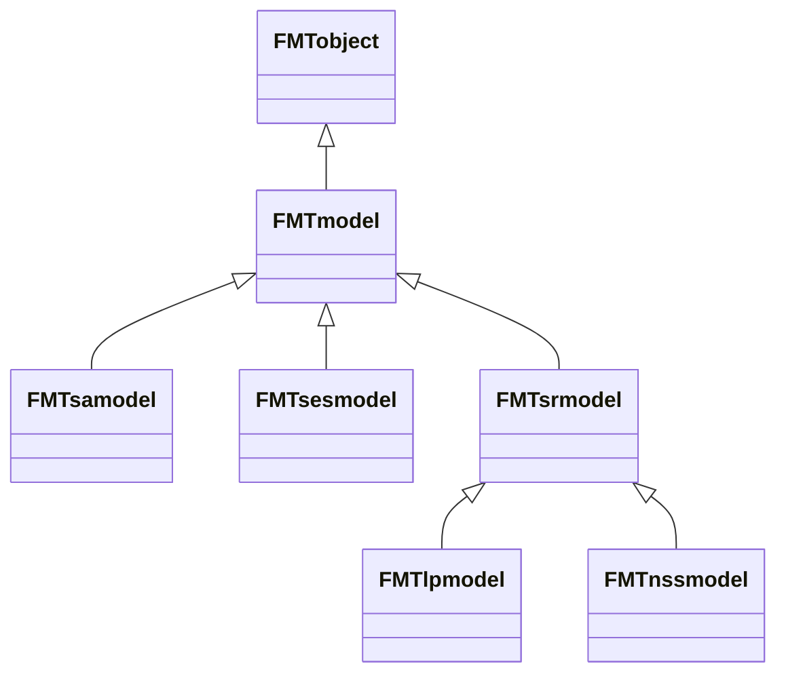

## What are objects ?

FMT is made with a particular structure that is called *Object-Oriented Programming* (OOP). If you never heard of it, here is a very quick summary of it to better understand how to use FMT later.

In the OOP approach, the program use different "objects" that have a certain "class", and that can have different "functions".

You might already know and use functions in software such as `R`. For example, in R, `plot()` is a function.

You might also be used to *some* objects and classes being called in software you use. For example, in `R`, `data <- read.csv(data.csv)` puts the content of the `data.csv` file into the `data` object, which has the class `data frame`.

Now, imagine that every function that you use are associated to an object of a particular class. For example, a class `dog` would have the function `bark_at()`. If we have a class named `cat`, we could then :

- Create a new `dog` object from the `dog` class : `pluto = dog(name = Pluto, age = 8)`
- Create a new `cat` object from the `cat` class : `felix = cat(name = Felix, age = 2)`
- Make the dog bark at the cat : `pluto.bark_at(felix)`

In turn, object can have "properties", which are exactly what it sounds like. For example, let say that our `cat` class has three properties : `name` (which can be a string of characters), `age` (which can be a number), and `scared` (which is a boolean, `true` or `false`).

In our previous example, before using `pluto.bark_at(felix)`, the property `felix.scared` could be `false`. But now that we used `pluto.bark_at(felix)`, `felix.scared` might have changed to `true`.

Lastly, a *parent class* in Object Oriented Programming means that the *child class* will automatically *inherit* all of the functions and properties of the parent function.

For example, let's suppose that we have a `animal` parent class from which the `dog` and `cat` classes derive. If the `animal` class has a function `breathing` (`animal.breathing()`), then the `dog` and `cat` classes being its *child* classes will automatically have this function (`dog.breathing()` and `cat.breathing()`).

*Object-Oriented Programming* is a particular way to program, embedded in the programming language that you use, that have multiple advantages. One of them is to make things easier to represent.

**In short** : FMT uses *Object-Oriented Programming*, which makes everything an object with particular functions. The functions and properties of an object are defined by its class. 

To learn to use FMT, you will learn what its main classes are, so that you can create the objects you need, and make them interact to do the things you want to do. This is because wherever in Python, R or C++, using FMT means using its different objects.

## The namespaces of FMT

The different classes of objects in FMT are grouped into *namespaces*, which are simply different sections of its files.

In FMT, the different *namespaces* are :

- **`Parser`** : Classes used for reading or editing the files of the models in Woodstock format
- **`Models`** : Manipulating and solving the models
- **`Spatial`** : Making things spatially explicit
- **`Heuristics`** : Contains the heuristics used for spatially aggregating the cut blocks, and planning them through time
- **`Version`** : Contain informations about the current version of FMT, and the functions it contains (which depends on how it was compiled)

{}
If you look at the [importation of FMT in Python](../../download_install/importing_in_python/), you'll see that we import the main namespaces that you will need into Python.
{}

## Important classes of the `Parser` namespace

The `Parser` namespace contains two important class for reading models :

- `FMTareaparser` : Allows the reading and writing of the raster and vector files used in the spatial operations of FMT.
	- Some of its functions allows you to transform data between vector and raster format.
- `FMTmodelparser` : Allows the reading of a model across all of the Woodstock model files with the `readproject()` function, or to save it with the `write()` function after modifying it.
	- The class also use other classes made to read Woodstock files.

## The `FMTmodel` class

The `FMTmodel` class is the basis of FMT.

It contains informations coming from the files of the models, in Woodstock format. This can be seen by [looking at the properties of the `FMTmodel`](../../../doxygen/classModels_1_1FMTmodel.html#pro-attribs) :



However, these attributes are "protected" so that they are not edited in the wrong way. If you want to read them when using FMT, you will have to use [the *getter* functions](../../../doxygen/classModels_1_1FMTmodel.html#pub-methods) that will get them for you :



Additionally, you can edit them in the right way by using [the *setter* functions](../../../doxygen/classModels_1_1FMTmodel.html#pub-methods). This allows you to edit different parts of the model.



In the end, the `FMTModel` is what we call a *parent class* for all of the different class of models that FMT uses, such as `FMTlpmodel` (linear programming model), and `FMTsesmodel` (spatialy explicit model) according to the following diagram :



Observe that all of these classes ultimately inherit from the `FMTobject` class. This is the case for every object in FMT, as `FMTobject` contains useful functions and properties for debugging FMT.

The `FMTnssmodel` and `FMTlpmodel` are spatially referenced models. The `FMTlpmodel` is used for **optimization**, while `FMTnssmodel` is used for **simulation**.

Meanwhile, the `FMTsesmodel` and `FMTsamodel` are spatially explicit models. In the same way, `FMTsamodel` is used for **optimization**, while `FMTsesmodel` is used for **simulation**.

**We will take a closer look at the different types of models later. For now, we will only use the simplest model that correspond to a Woodstock model structure, the `FMTlpmodel`.**

## Loading a simple `FMTlpmodel`

Here is an example of how it looks like to read a linear programming model (in Woodstock format) with FMT.

In R, the code to use it would be :

```R
library(FMT) # Loads FMT into R
if (new(FMTversion)$hasfeature("OSI")) # Checks if FMT has been compiled with OSI by creating a new FMTversion object, and using the function hasfeature().
{
	# Creating the parser object to read the model files
	newmodelparser <- new(FMTmodelparser)
	# Reading the project with the model parser by specifying that we want the scenario named "LP" (there can be different scenarios for one model)
	modelslist <- newmodelparser$readproject("Models/TWD_land/TWD_land.pri", c("LP"), TRUE, TRUE, TRUE)
	model_scenario_lp <- modelslist[[1]]
	# We get the name of the model
	print(model_scen_lp$getname())
} else { # if the model hasn't been compiled with OSI, we display an error.
	print("FMT needs to be compiled with OSI")
}
```

In Python, the code would look like this:

```python
import sys
from FMT import Models
from FMT import Parser
from FMT import Version

if __name__ == "__main__":
	if Version.FMTversion().hasfeature("OSI"):
		# Creating the parser object to read the model files
		newmodelparser=  Parser.FMTmodelparser()
		path = "Models/TWD_Land/TWD_Land.pri"
		scenarios = ["LP"]
		# Reading the project with the model parser by specifying that we want the scenario named "LP" (there can be different scenarios for one model)
		modelslist = newmodelparser.readproject(path, scenarios)
		model_scen_lp = modelslist[0]
		print(model_scen_lp.getname())
	else:
		print("FMT needs to be compiled with OSI")
```

Wherever in the R prompt or the Python terminal, the result should give the following :

```bash
Reading Models/TWD_land/TWD_land.pri
FMT 0.9.1, build: Sep 30 2021 12:07:49
Tue Oct 05 10:59:57 2021
Reading Scenario Lp
FMTexc(39)Undefined _death action: _DEATH FMTsection(4)Action
FMTexc(40)Undefined _death transition: _DEATH FMTsection(5)Transition
Done reading Tue Oct 05 10:59:57 2021
[1] "LP"
```

As you can see, FMT indicated that it has read the scenario "LP", and returned its name.

## The `Core` namespace

The `Core` namespace contains elements used by FMT "under the hood" to make the `FMTModel` object function.

For example, it contains the objects :

- `FMTaction` : Class that defines the operability of multiple strata for a given disturbance.
- `FMTtransition` : Class that defines the transitions of multiple strata for a given disturbance.
- `FMTyields` : Class that defines the growth and yields values for every strata.
- `FMToutputs` : Class that defines the outputs in the model (inventory or action based), but not the outputs *of* the model (e.g., output files or others)
- `FMTconstraints` : Class that defines the global constraints and the objective of the model (e.g., variable to optimize).

These different objects can be called from a `FMTmodel` object with the different *getter* functions.

For example, to see the list of `FMTaction` objects associated with a particular `FMTmodel`, you can use the `FMTModel.getactions()` (or `FMTModel$getactions()` in R) function, and use a `for` loop to display every action other it. **The actions displayed in such way will correspond to the actions present in the `.act` file of the Woodstock files for the model**.

Here is an example of displaying the actions and the transitions of a `FMTmodel` in R code :

```R
library(FMT) # Loads FMT into R
if (new(FMTversion)$hasfeature("OSI")) # Checks if FMT has been compiled with OSI by creating a new FMTversion object, and using the function hasfeature().
{
	# Creating the parser object to read the model files
	newmodelparser <- new(FMTmodelparser)
	# Reading the project with the model parser by specifying that we want the scenario named "LP" (there can be different scenarios for one model)
	modelslist <- newmodelparser$readproject("Models/TWD_land/TWD_land.pri", c("LP"), TRUE, TRUE, TRUE)
	model <- modelslist[[1]]
	# We get the name of the actions in the model
	print("***** Here is the name of the actions")
	for (action in model$getactions())
	{
		print(action$getname())
	}
	print("***** Here is the name of the transitions")
	for (transition in model$gettransitions())
	{
		# We concatenate the entry for the transition to make it more readable in the prompt
		cat(transition$str())
	}

} else { # if the model hasn't been compiled with OSI, we display an error.
	print("FMT needs to be compiled with OSI")
}
```

This R code will result in the following text in the R prompt :

```bash
Reading Models/TWD_land/TWD_land.pri
FMT 0.9.1, build: Sep 30 2021 12:07:49
Tue Oct 05 10:59:57 2021
Reading Scenario Lp
FMTexc(39)Undefined _death action: _DEATH FMTsection(4)Action
FMTexc(40)Undefined _death transition: _DEATH FMTsection(5)Transition
Done reading Tue Oct 05 10:59:57 2021
[1] "***** Here is the name of the actions"
[1] "CLEARCUT"
[1] "ACARIBOU"
[1] "PLANTATION"
[1] "AFIRE"
[1] "ARECUP"
[1] "_DEATH"
[1] "***** Here is the name of the transitions"
*CASE CLEARCUT
*SOURCE ? ? ?
*TARGET ? ? ? 100.000000
*CASE ACARIBOU
*SOURCE ? ? ?
*TARGET ? ? ? 100.000000 _LOCK 1
*CASE PLANTATION
*SOURCE ? ? ?
*TARGET ? STAND1 ? 100.000000
*CASE AFIRE
*SOURCE ? ? ?
*TARGET ? FIRE ? 100.000000
*CASE ARECUP
*SOURCE ? FIRE ?
*TARGET ? STAND1 ? 100.000000
*CASE _DEATH
*SOURCE ? ? ?
*TARGET ? ? ? 100.000000
```

The equivalent in Python code is :

```python
import sys
from FMT import Models
from FMT import Parser
from FMT import Version

if __name__ == "__main__":
	if Version.FMTversion().hasfeature("OSI"):
		# Creating the parser object to read the model files
		newmodelparser=  Parser.FMTmodelparser()
		path = "Models/TWD_Land/TWD_Land.pri"
		scenarios = ["LP"]
		# Reading the project with the model parser by specifying that we want the scenario named "LP" (there can be different scenarios for one model)
		modelslist = newmodelparser.readproject(path, scenarios)
		model = modelslist[0]
		# We get the name of the actions in the model
		print("***** Here is the name of the actions")
		for action in model.getactions():
			print(action)
		print("***** Here is the name of the transitions")
		for transition in model.gettransitions():
			print(transition.getname())
	else:
		print("FMT needs to be compiled with OSI")
```

Which will result in the following text in the Python terminal. Note that while the outputs between R and Python should usually be the same, there are sometimes small differences. Here, the Python version will display more information about the actions, and just the name of the transitions when compared to R; this is due to the particularities of the two languages.

```bash
Reading Models/TWD_land/TWD_land.pri
FMT 0.9.1, build: Sep 30 2021 12:07:49
Tue Oct 05 10:59:57 2021
Reading Scenario Lp
FMTexc(39)Undefined _death action: _DEATH FMTsection(4)Action
FMTexc(40)Undefined _death transition: _DEATH FMTsection(5)Transition
Done reading Tue Oct 05 10:59:57 2021
***** Here is the name of the actions
*ACTION CLEARCUT Y
*OPERABLE COUPETOTALE
? ? ? TOTALVOLUME >= 100.000000

*ACTION ACARIBOU N
*OPERABLE ACARIBOU
UC ? ? _AGE >= 8

*ACTION PLANTATION Y _LOCKEXEMPT
*OPERABLE PLANTATION
? ? ? _AGE >= 1 AND _AGE <= 3

*ACTION ARECUP Y
*OPERABLE AFIRE
? PROD ? _AGE >= 1

*ACTION ARECUP Y
*OPERABLE ARECUP
? FEU ? _AGE = 0

*ACTION _DEATH Y _LOCKEXEMPT
*OPERABLE _DEATH
? ? ? _AGE >= 80

***** Here is the name of the transitions
CLEARCUT
ACARIBOU
PLANTATION
AFIRE
ARECUP
_DEATH
```

## Comparing elements in FMT

A common operation to do in your scripts will be to compare elements : for example, to compare the name of a `FMTaction` object with the name of the action that you want to select, etc.

In such cases, remember that **all strings read by FMT are automatically set to upper case strings**. Therefore, **if you want to compare elements name in FMT make sure the string is in uppercase**.

For example, if you have an action named `Clearcut` or `clearcut` that you want to select, you will need to compare the name of the `FMTactions` of the models with the string `CLEARCUT`, all in upper case.

## Conversion of errors to warnings

All FMT classes inherit from the class `FMTobject`, and thus share the same `FMTexceptionhandler` and `FMTlogger`.

If the user want to ignore some error, he can use the function `seterrorstowarnings` of any FMT class and pass a vector of errors that the handler needs to consider warnings. This function is risky and can lead to errors. It is recommended that you investigate FMT error messages and correct the model accordingly.

* * *

Now that you know everything about the structure of FMT and its basic elements, we will take a look at how to do spatially referenced optimization with it, which is one of the main functions of FMT.