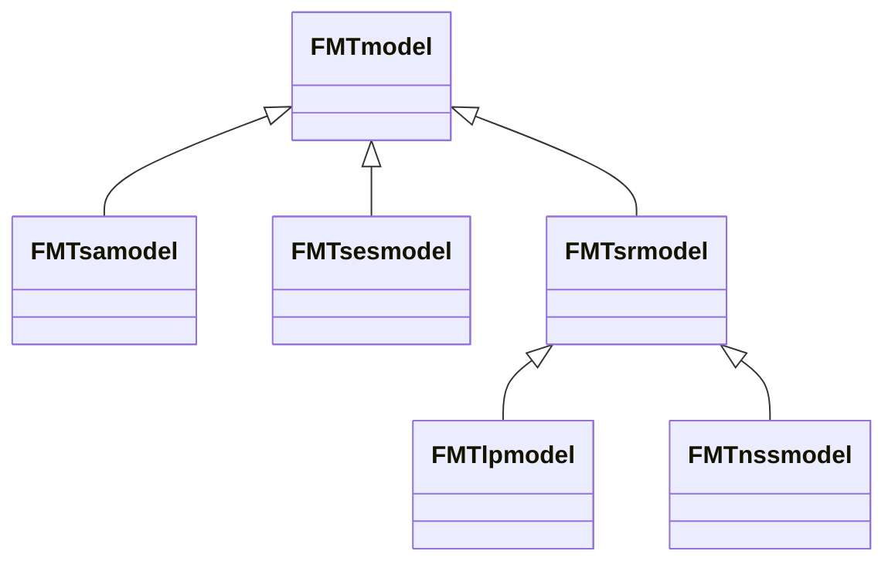

## A quick reminder of the meaning of "spatially explicit"

We can distinguish 3 ways that space can be taken into account in a model :

- In a **non-spatial model** or **spatially implicit model**, entities (e.g., forests, animals, agents, etc.) are not directly associated with a position in space, but the relation between them in the model can imply that only some of them interact with each other in a way to mimic a spatial disposition.
- In a **spatially referenced model**, entities are associated to regions in space, but not to a precise position in those regions; those regions can be non-continuous. Woodstock models are spatially referenced in nature, as they consider *strata* that correspond to forests with the same composition and age, which can be dispersed in many places in the landscape.
- In a **spatially explicit model**, entities are associated to precise coordinates in space, like in the pixels of a raster map.

## The `FMTsesmodel`

`FMTsesmodel` is a particular model that gives the user the opportunity to **spatialize** solutions coming from any `FMTsrmodel` class, which are the spatially referenced models (see [objects, model parsing and interrogation](../objects_parsing_interrogation) and [spatially referenced optimization](../spatially_referenced_optimization)).

Note that **we are not talking about optimizing a spatially explicit model**; this is quite a complex task that is still on the roadmap of FMT (and which is the goal of the `FMTsamodel` class).



Instead, the `FMTsesmodel` will try to spatialize the schedule of a `FMTsrmodel` by placing cut blocks on a map, by doing multiple iterations of simulating the placement of these blocks, and by selecting the best solution that is found.

To use a metaphor, this would be like trying to find a winning position at chess if you don't find yourself capable of finding it by thinking carefully about the placement of your chess pieces : you could try to place your pieces randomly many, many times, and asking each time if you have won, or if you are closer to victory, and if the position of the chess pieces respect the rules of the game.

Here, `FMTsesmodel` will try to place cut blocks according to the solution of a `FMTsrmodel` (which is a schedule of forest operations applied to spatially referenced *strata*). Its goal will be to find the best positioning possible, by accommodating to the constraints that are set in their placement as best as possible, and by maximizing the objective value (e.g. maximizing the harvested wood).

However, this method have a low chance of finding the **optimal placement**, if one exists; instead, the more iterations it does in trying to place them, there higher the chance to find a solution that is as close as possible as an optimal placement of the cut blocks in space. This is why this process represents what we call a [heuristic](https://en.wikipedia.org/wiki/Heuristic).

## The spatial framework inside FMT

FMT uses `FMTlayers` to represent any spatially explicit solution.

A `FMTlayer` can be compared to a regular raster file in which pixels can contain pretty much any type or class of forest stand.

In the `FMTsesmodel`, we use the `FMTspatialschedule` class to represent a spatially explicit solution, which itself is a `FMTlayer` of `FMTlinegraph`.

Each `FMTlinegraph` is a linear version of the `FMTgraph` described in [spatially referenced optimization](../spatially_referenced_optimization). What that means is that they show the evolution of the `FMTdevelopment` inside the pixel from the beginning to end of the periods that we want to take into account.

## The `FMTspatialschedule` class

The `FMTspatialschedule` class contains a spatially explicit solution under the form of a `FMTlayer`. 

It contains an important function, `FMTspatialschedule.getsolutionstatus()`, which prints important information about how much the solution contained in the `FMTspatialschedule` achieves the objective function of the model.

This function also gives a value of the *primal infeasibility*, which gives an idea of how much the current solution does not respect all of the constraints of the model at once.

Note that unlike the `FMTschedule` object which only concern one periods of time (which is why the code shown in the section about [spatially referenced optimization](../spatially_referenced_optimization) contained a `for` loop around the number of period of interest when dealing with the `FMTschedule` class), `FMTspatialschedule` contains a solution for multiple periods of time at once.

## The `FMTlinegraph`

As said earlier, the spatial structure of a `FMTsesmodel` is like a raster map made of pixels, with each pixels being a `FMTlinegraph`.

In a `FMTlinegraph`, each node stands for the state of the strata inside the pixel and each edge stands for an action (e.g. cleartcut) or natural growth, as shown of this image :



However, on the contrary of the `FMTgraph` object described in the section about [spatially referenced optimization](../spatially_referenced_optimization), the `FMTlinegraph` does not contain a complete enumeration of all possible actions and states possible for the strata in the pixel : instead, it only contains one solution, or one evolution possible for the strata.

## Making transitions with single outputs

A limitation of the `FMTlinegraph` class is that one cannot use multiple output transitions, meaning transitions that results in two different strata or other outputs, as illustrated below :



Therefore, **you will need to modify the transitions of an `FMTmodel` to be able to use them in a `FMTsesmodel`**.

To that end, you can use the `FMTtransition.single()` function, which automatically transforms multiple outputs transitions into single output transitions.

Once that the transitions have been transformed as single transitions, you can use the `FMTsesmodel.settransitions()` function to set the new generated transitions into the `FMTsesmodel`.

## Spatial events

The `FMTspatialschedule` also keeps tracks of the areas affected by particular actions under the form of space time events with the class `FMTevent`, as is shown here :



`FMTevent` can represent any kind of spatially explicit disturbance (cut, fire, etc.). It is associated with the time period of the event, and the coordinates of the spatial event.



## The initial forest map

As a spatially explicit model, the `FMTsesmodel` requires spatially explicit informations about the forests in the landscape at the beginning of the planning horizon.

To get this information from a Woodstock model (that might have served to create a `FMTlpmodel` that you optimized; see [spatially referenced optimization](../spatially_referenced_optimization)), you will need to retrieve this information from the vector file that serves as the Woodstock model's map. This vector file contains information about the *theme*, *age* and *lock* attributes for each strata which will need to be transferred into multiple spatially explicit rasters.

All of this information will be contained in the `FMTforest` object, which is the equivalent of the model's map, but that is based on a `FMTlayer`. Each pixel of a `FMTforest` object contains a `FMTactualdevelopment` object.

The `FMTareaparser` class can be used to generate the `FMTforest` needed for the `FMTsesmodel`, as it contains functions to read vectorial or raster maps from a Woodstock model.

- `FMTareaparser.vectormaptoFMTforest()` allows you to read an existing vector (shapefile) map
- `FMTareaparser.readrasters()` allows you to read existing rasters maps

Both functions require several parameters to properly identify the themes that are needed, and specify several spatial characteristics of the `FMTforest` class that you will create.

Once that the `FMTforest` is created, it needs to be given to the `FMTsesmodel` by using the `FMTsesmodel.setinitialmapping()` function.

## Using new keywords in Woodstock files for spatial constraints

In a usual Woodstock model, spatial constraints are not taken into account. However, you will certainly need to use some for a spatial simulation with the `FMTsesmodel` to place the cut blocks of the optimized schedule.

To that end, FMT can read two new keywords in the *optimize* section of a Woodstock model that do not exist in the original Woodstock syntax.

These keywords are `_SIZE` and `_ADJACENCY`.

`_SIZE` is to be used with the following syntax in the *optimize* section of a Woodstock model :

```_SIZE(ACTION, NEIGHBORSIZE) >= <SIZE IN PIXELS> <PERIODS>```

Note that :

- `ACTION` can also be an aggregate of several actions, so that multiple actions can be subject to the same constraint
- `NEIGHBORSIZE` describe how the spatial event spread from one pixel to another pixel, following this graph :

- `<PERIODS>` correspond to the period of time for which to set the constraint

As such, the `_SIZE` constraint can give a minimal or maximal size for the event of specified actions, in number of contiguous pixels. It will result in the creation of spatial *blocks* of pixels where the action has been applied.

Meanwhile, `_ADJACENCY` is used with the following syntax :

`_ADJACENCY(ACTION, GREENUP) >= <DISTANCE> <PERIODS>`

With :

- `ACTION` can again be an aggregate of several actions, so that multiple actions can be subject to the same constraint.
- `<PERIODS>` again correspond to the period of time for which to set the constraint.
- `DISTANCE` corresponds to the minimal or maximal adjacency distance between two spatial blocks of one or several actions (whose size was defined by `_SIZE`). Hence, for a `DISTANCE` >= 3, we will have the following :

- `GREENUP` correspond to the number of time periods for which we consider two events to be neighbours. For example, if `GREENUP` is equal to 3, two spatial blocks of actions that are under the maximal distance indicated by `DISTANCE` but which are separated temporally by 4 periods will not be considered spatially adjacent; however, if they were separated by 3, 2 or 1 period, or are in the same period, they will be considered spatially adjacent.

## Making the simulation with `FMTsesmodel.Greedyreferencebuild()`

Once that you have a spatially-referenced solution/schedule (see [spatially referenced optimization](../spatially_referenced_optimization)) and that you have set the initial landscape for the `FMTsesmodel` (see previous sections), you can use `FMTsesmodel.Greedyreferencebuild()` to make the simulation proper, and obtain a spatially-explicit schedule based on the spatially-referenced schedule.

`FMTsesmodel.Greedyreferencebuild()` needs a the spatially-referenced solution of a `FMTlpmodel` (or a `FMTnssmodel`), in the form of a `FMTschedule` object. This solution describes which development (or strata) get harvested for one period, with which action, and at which surface/area.

The `FMTschedule` from a solutioned `FMTlpmodel` or `FMTnssmodel` can be retrieved using their function `getsolution()`. However, the function will retrieve the solution for one period; we will have to loop around the periods to get the solutions for every period of interest, and to indicate if we want the solution to take into account locked developments.

`FMTsesmodel.Greedyreferencebuild()` will build a spatially explicit solution from a spatially-referenced one for a given period. Along with the `FMTschedule` for the period, the function will need a `randomiterations` argument which is the maximal number of iterations done by the algorithm before it stops when no increase in the objective function value (maximization) or decrease in the primal infeasibility value was found. This is because the simulation consist of iterations where the model will try to place cutblocks in space according to the spatially-referenced schedule in order to increase the objective function of the model (e.g., volume harvested) while respecting the linear and spatial constraints that was given (whose deviation from is represented by the primal infeasibility value).

A last input is a seed number that will be used to generate random numbers used for creating the cut blocks at each iteration. This system of seed allows FMT to use random numbers that are "replicable"; that means, if you keep the same seed, FMT will get the same random numbers, and will do the exact same simulations.

Here is a representation of how the simulation algorithm functions in practice :



In R, the code to use `FMTsesmodel.Greedyreferencebuild()` will look like this :

```R
library(FMT) # Loads FMT into R
if (new(FMTversion)$hasfeature("OSI")) # Checks if FMT has been compiled with OSI by creating a new FMTversion object, and using the function hasfeature().
{
	# We read and solve a FMTlpmodel; see the spatially referenced optimization for more details
	newparser <- new(FMTmodelparser)
	modelslist <- newmodelparser$readproject("Models/TWD_land/TWD_land.pri", c("Spatial"), TRUE, TRUE, TRUE)
	solverinterface <- list(CLP=1,MOSEK=2,CPLEX=3,GUROBI=4)
	lpmodel <- new(FMTlpmodel,modelslist[[1]],solverinterface$MOSEK)
	emptyschedule <- new(FMTschedule)
	for (period in 1:10)
	{
		print(lpmodel$buildperiod(emptyschedule,FALSE,1)$str())
	}
	allmodelconstraints <- lpmodel$getconstraints()
	modelobjective <- allmodelconstraints[[1]]
	modelconstraints <- allmodelconstraints[2:length(allmodelconstraints)]
	for (constraint in modelconstraints)
	{
		print(lpmodel$setconstraint(constraint)$str())
	}
	print(lpmodel$setobjective(modelobjective)$str())
	# Here, by testing if the model is able to be solved, we solve the model as initialsolve() does both.
	if (lpmodel$initialsolve())
	{
		# We create a new spatialy explicit simulation model, based on the content of lpmodel
		simulationmodel <- new(FMTsesmodel, lpmodel)
		# We make sure that the transition in the model are single output, and we modify them if needed.
		singletransition <- list()
		for (transition in simulationmodel$gettransitions())
		{
			# The +1 here is made to adapt to the fact that FMT have a C++ code that works in base 0; while R works in base 1 (1 is the first index number of a list)
			singletransitions[[length(singletransitions) + 1]] <- transition$single()
		}
		simulationmodel$settransitions(singletransitions)
		# We prepare a parser to read the initial forest map
		areaparser <- new(FMTareaparser)
		# We define where the raster with the information about the initial age of all forests.
		rasterslocation <- "../Models/TWD_land/rasters"
		ageraster <- file.path(rasterlocation,"AGE.tif")
		# We read the different rasters that contain the initial "themes" (attribute) of the different forests
		# by doing a loop on all of the themes defined in the model, and by putting them in a list
		themesrasters <- list()
		themeid <- 1
		for (theme in simulationmodel$gethemes())
		{
			themesrasters[[length(themesrasters) + 1]] <- file.path(rasterslocation, paste("THEME", paste0(themeID), ".tif", sep = ""))
			themeid <- themeid + 1
		}
		# Now that we have all of the rasters, we create a FMTforest object by reading all of theme, which will contain the initial forest data.
		initialforestmap <- areaparser$readrasters(simulationmodel$getthemes(), unlist(themerasters), ageraster, 1, 0.0001, "")
		# We give the initial forest data to the spatially explicit model
		simulationmodel$setinitialmapping(initialforestmap)
		# Now, we find the spatially explicit solution for each period based on the solution of the lpmodel for this period.
		# We will stop the search of the algorithm once that it will have made no progress in increasing the optimization function
		# or reduced the primal infeasibility since 10 iterations.
		for (period in 1:10)
		{
			print(simulationmodel$greedyreferencebuild(lpmodel$getsolution(period,FALSE), 10, 0, 0.0001))
		}

	}

} else { # if the model hasn't been compiled with OSI, we display an error.
	print("FMT needs to be compiled with OSI")
}
```

The equivalent in Python is :

```python
import sys
from FMT import Models
from FMT import Parser
from FMT import Version

if __name__ == "__main__":
	if Version.FMTversion().hasfeature("OSI"):
		# We read and solve a FMTlpmodel; see the spatially referenced optimization for more details
		newmodelparser=  Parser.FMTmodelparser()
		path = "Models/TWD_Land/TWD_Land.pri"
		scenarios = ["Spatial"]
		modelslist = newmodelparser.readproject(path, scenarios)
		lpmodel = Models.FMTlpmodel(modelslist[0], Models.FMTsolverinterface.CLP)
		for period in range(1, 11):
			print(lpmodel.buildperiod())
		constraints = lpmodel.getconstraints()
		objective = constraints.pop(0)
		for constraint in constraints:
			lpmodel.setconstraint(constraint)
		lpmodel.setobjective(objective)
		# Here, by testing if the model is able to be solved, we solve the model as initialsolve() does both.
		if lpmodel.initialsolve():
			# We create a new spatialy explicit simulation model, based on the content of lpmodel
			simulationmodel = Models.FMTsesmodel(lpmodel)
			# We make sure that the transition in the model are single output, and we modify them if needed.
			singletransitions = []
			for transition in simulationmodel.gettransitions():
				singletransitions.append(transition.single())
			simulationmodel.settransitions(singletransitions)
			# We prepare a parser to read the initial forest map
			areaparser = Parser.FMTareaparser()
			# We define where the raster with the information about the initial age of all forests.
			rasterslocation = "../Models/TWD_land/rasters/"
			ageraster = os.path.join(rasterslocation, "AGE.tif")
			# We read the different rasters that contain the initial "themes" (attribute) of the different forests
			# by doing a loop on all of the themes defined in the model, and by putting them in a list
			themesrasters = []
			themeid = 1
			for theme in simulationmodel.getthemes():
				themesrasters.append(os.path.join(rasterslocation, "THEME" + str(themeid) + ".tif"))
				themeid += 1
			# Now that we have all of the rasters, we create a FMTforest object by reading all of theme, which will contain the initial forest data.
			initialforestmap = areaparser.readrasters(simulationmodel.getthemes(), themesrasters, ageraster, 1, 0.0001)
			# We give the initial forest data to the spatially explicit model
			simulationmodel.setinitialmapping(initialforestmap)
			# Now, we find the spatially explicit solution for each period based on the solution of the lpmodel for this period.
			# We will stop the search of the algorithm once that it will have made no progress in increasing the optimization function
			# or reduced the primal infeasibility since 10 iterations.
			for period in range(1, 11):
				print(simulationmodel.greedyreferencebuild(lpmodel.getsolution(period), 10))
	else:
		print("FMT needs to be compiled with OSI")
```

The output of both codes should be the following. There is a lot to process, but we will look at it more precisely at the next section :

```bash
Reading D:/TempCode/FMT/FMT/Examples/Models/TWD_land/TWD_Land.pri 
FMT 0.9.1, build: Oct 22 2021 11:52:53
Fri Feb 18 12:44:56 2022
Reading scenario Spatial
FMTexc(41)Ignoring: YBM_RTM_MEH at line 44 FMTsection(6)Yield
FMTexc(39)Undefined _death action: _DEATH FMTsection(4)Action
Done reading Fri Feb 18 12:44:56 2022
Columns: 69 Rows: 34 Vertices: 62 Edges: 69 Transfer Rows: 34 Output Rows: 0 Output Columns: 0
Columns: 173 Rows: 86 Vertices: 126 Edges: 173 Transfer Rows: 86 Output Rows: 0 Output Columns: 0
Columns: 320 Rows: 156 Vertices: 208 Edges: 320 Transfer Rows: 156 Output Rows: 0 Output Columns: 0
Columns: 510 Rows: 244 Vertices: 308 Edges: 510 Transfer Rows: 244 Output Rows: 0 Output Columns: 0
Columns: 730 Rows: 350 Vertices: 426 Edges: 730 Transfer Rows: 350 Output Rows: 0 Output Columns: 0
Columns: 986 Rows: 474 Vertices: 562 Edges: 986 Transfer Rows: 474 Output Rows: 0 Output Columns: 0
Columns: 1278 Rows: 616 Vertices: 716 Edges: 1278 Transfer Rows: 616 Output Rows: 0 Output Columns: 0
Columns: 1606 Rows: 776 Vertices: 888 Edges: 1606 Transfer Rows: 776 Output Rows: 0 Output Columns: 0
Columns: 1992 Rows: 964 Vertices: 1088 Edges: 1992 Transfer Rows: 964 Output Rows: 0 Output Columns: 0
Columns: 2436 Rows: 1180 Vertices: 1316 Edges: 2436 Transfer Rows: 1180 Output Rows: 0 Output Columns: 0
Coin0506I Presolve 76 (-1143) rows, 226 (-2211) columns and 898 (-5379) elements
Clp0035I 0 Primal 100 Dual 842632.63 Complementarity 842579 - 0 fixed, rank 76
Clp0035I 1 Primal 225.4735 Dual 307283.38 Complementarity 318751.96 - 0 fixed, rank 76
Clp0035I 2 Primal 7266.7264 Dual 146511.3 Complementarity 174120.63 - 0 fixed, rank 76
Clp0035I 3 Primal 35053.074 Dual 105622.03 Complementarity 73089.174 - 0 fixed, rank 76
Clp0035I 4 Primal 38320.846 Dual 70235.705 Complementarity 33405.695 - 0 fixed, rank 76
Clp0035I 5 Primal 44403.19 Dual 55792.68 Complementarity 11676.178 - 0 fixed, rank 76
Clp0035I 6 Primal 46801.335 Dual 50712.255 Complementarity 3964.085 - 0 fixed, rank 76
Clp0035I 7 Primal 47534.239 Dual 48865.81 Complementarity 1331.5805 - 0 fixed, rank 76
Clp0035I 8 Primal 47849.045 Dual 48152.188 Complementarity 303.14539 - 0 fixed, rank 76
Clp0035I 9 Primal 47959.375 Dual 48049.655 Complementarity 90.456075 - 0 fixed, rank 76
Clp0035I 10 Primal 47999.651 Dual 48009.843 Complementarity 10.204147 - 0 fixed, rank 76
Clp0035I 11 Primal 47998.773 Dual 48000.252 Complementarity 1.4873248 - 0 fixed, rank 76
Clp0035I 12 Primal 47999.994 Dual 48000.002 Complementarity 0.0085757189 - 0 fixed, rank 76
Clp0035I 13 Primal 48000 Dual 48000 Complementarity 0.00011127406 - 0 fixed, rank 70
Clp0035I 14 Primal 48000 Dual 48000 Complementarity 1.102542e-06 - 0 fixed, rank 63
Clp0035I 15 Primal 48000 Dual 48000.074 Complementarity 8.4407744e-09 - 20 fixed, rank 68
Clp0035I 16 Primal 48000 Dual 48000 Complementarity 6.8286544e-11 - 20 fixed, rank 65
Clp0042I Optimal
Clp0046I At end primal/dual infeasibilities 0.00015298276/0.10009623, complementarity gap 4.668539e-06, objective 48000
Clp0006I 0  Obj 48000 Dual inf 0.015282 (8)
Clp0006I 152  Obj 48000
Clp0000I Optimal - objective value 48000
Clp0006I 0  Obj 48000
Clp0000I Optimal - objective value 48000
Clp0006I 0  Obj 48000
Clp0000I Optimal - objective value 48000
Coin0511I After Postsolve, objective 48000, infeasibilities - dual 0 (0), primal 0 (0)
Clp0032I Optimal objective 48000 - 16 iterations time 0.022, Presolve 0.01
Iteration 0 Primal Inf(0.000000) Obj(40475.320000)
Iteration 10 Primal Inf(0.000000) Obj(44085.320000)
Stalled after 16 iterations Skipping
{'ACARIBOU': 0.981677543988014, 'COUPETOTALE': 0.9817026645791909, 'Objective': 42453.599999999984, 'Primalinfeasibility': 0.0, 'Total': 0.9816850800303768}
Iteration 0 Primal Inf(2310.400000) Obj(40143.200000)
Iteration 10 Primal Inf(216.600000) Obj(42237.000000)
Iteration 20 Primal Inf(0.000000) Obj(42453.600000)
Solution stuck after 30 iterations Skipping
{'ACARIBOU': 1.0278470194296387, 'COUPETOTALE': 0.9116104392588846, 'Objective': 42453.599999999984, 'PLANTATION': 0.927291117344956, 'Primalinfeasibility': 1.4551915228366852e-11, 'Total': 0.9264994202031354}
Iteration 0 Primal Inf(2108.240000) Obj(42453.600000)
Iteration 10 Primal Inf(2108.240000) Obj(42453.600000)
Iteration 20 Primal Inf(635.360000) Obj(42453.600000)
Solution stuck after 27 iterations Skipping
{'ACARIBOU': 0.8973831819756647, 'COUPETOTALE': 0.9033560325101042, 'Objective': 42453.599999999984, 'PLANTATION': 0.911737449703183, 'Primalinfeasibility': 635.3600000000297, 'Total': 0.9025186555019942}
Iteration 0 Primal Inf(8779.520000) Obj(42453.600000)
Iteration 10 Primal Inf(8779.520000) Obj(42453.600000)
Iteration 20 Primal Inf(808.640000) Obj(42453.600000)
Solution stuck after 29 iterations Skipping
{'ACARIBOU': 0.8771528754492212, 'COUPETOTALE': 0.889988896215573, 'Objective': 42453.599999999984, 'PLANTATION': 0.8765659747164727, 'Primalinfeasibility': 808.6400000000212, 'Total': 0.8822416209150494}
Iteration 0 Primal Inf(6931.200000) Obj(42453.600000)
Iteration 10 Primal Inf(6931.200000) Obj(42453.600000)
Iteration 20 Primal Inf(1111.880000) Obj(42453.600000)
Solution stuck after 30 iterations Skipping
{'ACARIBOU': 0.8952525436304627, 'COUPETOTALE': 0.88445, 'Objective': 42453.599999999984, 'PLANTATION': 0.9411700993142432, 'Primalinfeasibility': 1111.8800000000338, 'Total': 0.9032996680762417}
Iteration 0 Primal Inf(9342.680000) Obj(42453.600000)
Iteration 10 Primal Inf(3638.880000) Obj(42453.600000)
Iteration 20 Primal Inf(3638.880000) Obj(42453.600000)
Iteration 30 Primal Inf(3638.880000) Obj(42453.600000)
Solution stuck after 35 iterations Skipping
{'ACARIBOU': 968.4932690882329, 'COUPETOTALE': 0.9397466289394396, 'Objective': 42453.599999999984, 'PLANTATION': 2367.8747068875177, 'Primalinfeasibility': 3638.8800000000047, 'Total': 1.0649491134961293}
Iteration 0 Primal Inf(16606.000000) Obj(30309.560000)
Stalled after 9 iterations Skipping
{'ACARIBOU': 1.3474601235578203, 'COUPETOTALE': 0.9825519488602954, 'Objective': 32937.64000000001, 'PLANTATION': 1.0022853728788734, 'Primalinfeasibility': 13977.919999999998, 'Total': 1.0087375080393326}
Iteration 0 Primal Inf(119576.200000) Obj(32937.640000)
Iteration 10 Primal Inf(65859.400000) Obj(32937.640000)
Iteration 20 Primal Inf(39247.920000) Obj(32937.640000)
Solution stuck after 28 iterations Skipping
{'ACARIBOU': 1054.0980891170655, 'COUPETOTALE': 0.845845565618348, 'Objective': 32937.64000000001, 'PLANTATION': 0.9266686936638757, 'Primalinfeasibility': 39247.9200000001, 'Total': 0.8969889215263215}
Iteration 0 Primal Inf(58611.960000) Obj(27522.640000)
Stalled after 6 iterations Skipping
{'ACARIBOU': 536.8311084909311, 'COUPETOTALE': 0.4341194959208162, 'Objective': 27667.040000000005, 'PLANTATION': 0.9541653732993195, 'Primalinfeasibility': 58467.560000000114, 'Total': 0.7846327502399465}
Iteration 0 Primal Inf(79145.640000) Obj(26208.600000)
Iteration 10 Primal Inf(77340.640000) Obj(27667.040000)
Stalled after 14 iterations Skipping
{'ACARIBOU': 10491.125109295706, 'COUPETOTALE': 0.3982872281191633, 'Objective': 27667.040000000005, 'PLANTATION': 1.0028031096555103, 'Primalinfeasibility': 77340.64000000012, 'Total': 0.8163283360740083}
```

## Analysing the outputs of `FMTsesmodel.Greedyreferencebuild()`

`FMTsesmodel.Greedyreferencebuild()` returns information on the best solution that have been found; which means the best spatial placement of cutblocks that the algorithm was capable of finding by optimizing the objective function, while respecting the linear and spatial constraints that were given by the user.

In particular, `FMTsesmodel.Greedyreferencebuild()` indicates 4 important information :

| Word | Description |
| :--: | :---------- |
| Objective |  Value of the objective function of the spatially explicit solution. |
| Primalinfeasibilities | Primal infeasibility value of the spatially explicit solution, relative to the constraints that were given. A value close to 0 means that the solution is 100% feasible according to the linear and spatial constraints. |
| Total | Total proportion of the area of the spatially referenced schedule passed as input that has been spatialized successfully by the algorithm. |
| Actionname *x* | Proportion of the area spatialized of a given action *x* of the original spatially referenced solution passed to the function. |

Now, **let's look at the output of the previous section to try and understand what happened**.

First, we see the same usual outputs that indicates that FMT reads, and then solves the model using the CLP solver :

```bash
Reading D:/TempCode/FMT/FMT/Examples/Models/TWD_land/TWD_Land.pri 
FMT 0.9.1, build: Oct 22 2021 11:52:53
Fri Feb 18 12:44:56 2022
Reading scenario Spatial
FMTexc(41)Ignoring: YBM_RTM_MEH at line 44 FMTsection(6)Yield
FMTexc(39)Undefined _death action: _DEATH FMTsection(4)Action
Done reading Fri Feb 18 12:44:56 2022
Columns: 69 Rows: 34 Vertices: 62 Edges: 69 Transfer Rows: 34 Output Rows: 0 Output Columns: 0
Columns: 173 Rows: 86 Vertices: 126 Edges: 173 Transfer Rows: 86 Output Rows: 0 Output Columns: 0
Columns: 320 Rows: 156 Vertices: 208 Edges: 320 Transfer Rows: 156 Output Rows: 0 Output Columns: 0
Columns: 510 Rows: 244 Vertices: 308 Edges: 510 Transfer Rows: 244 Output Rows: 0 Output Columns: 0
Columns: 730 Rows: 350 Vertices: 426 Edges: 730 Transfer Rows: 350 Output Rows: 0 Output Columns: 0
Columns: 986 Rows: 474 Vertices: 562 Edges: 986 Transfer Rows: 474 Output Rows: 0 Output Columns: 0
Columns: 1278 Rows: 616 Vertices: 716 Edges: 1278 Transfer Rows: 616 Output Rows: 0 Output Columns: 0
Columns: 1606 Rows: 776 Vertices: 888 Edges: 1606 Transfer Rows: 776 Output Rows: 0 Output Columns: 0
Columns: 1992 Rows: 964 Vertices: 1088 Edges: 1992 Transfer Rows: 964 Output Rows: 0 Output Columns: 0
Columns: 2436 Rows: 1180 Vertices: 1316 Edges: 2436 Transfer Rows: 1180 Output Rows: 0 Output Columns: 0
Coin0506I Presolve 76 (-1143) rows, 226 (-2211) columns and 898 (-5379) elements
Clp0035I 0 Primal 100 Dual 842632.63 Complementarity 842579 - 0 fixed, rank 76
Clp0035I 1 Primal 225.4735 Dual 307283.38 Complementarity 318751.96 - 0 fixed, rank 76
Clp0035I 2 Primal 7266.7264 Dual 146511.3 Complementarity 174120.63 - 0 fixed, rank 76
Clp0035I 3 Primal 35053.074 Dual 105622.03 Complementarity 73089.174 - 0 fixed, rank 76
Clp0035I 4 Primal 38320.846 Dual 70235.705 Complementarity 33405.695 - 0 fixed, rank 76
Clp0035I 5 Primal 44403.19 Dual 55792.68 Complementarity 11676.178 - 0 fixed, rank 76
Clp0035I 6 Primal 46801.335 Dual 50712.255 Complementarity 3964.085 - 0 fixed, rank 76
Clp0035I 7 Primal 47534.239 Dual 48865.81 Complementarity 1331.5805 - 0 fixed, rank 76
Clp0035I 8 Primal 47849.045 Dual 48152.188 Complementarity 303.14539 - 0 fixed, rank 76
Clp0035I 9 Primal 47959.375 Dual 48049.655 Complementarity 90.456075 - 0 fixed, rank 76
Clp0035I 10 Primal 47999.651 Dual 48009.843 Complementarity 10.204147 - 0 fixed, rank 76
Clp0035I 11 Primal 47998.773 Dual 48000.252 Complementarity 1.4873248 - 0 fixed, rank 76
Clp0035I 12 Primal 47999.994 Dual 48000.002 Complementarity 0.0085757189 - 0 fixed, rank 76
Clp0035I 13 Primal 48000 Dual 48000 Complementarity 0.00011127406 - 0 fixed, rank 70
Clp0035I 14 Primal 48000 Dual 48000 Complementarity 1.102542e-06 - 0 fixed, rank 63
Clp0035I 15 Primal 48000 Dual 48000.074 Complementarity 8.4407744e-09 - 20 fixed, rank 68
Clp0035I 16 Primal 48000 Dual 48000 Complementarity 6.8286544e-11 - 20 fixed, rank 65
Clp0042I Optimal
Clp0046I At end primal/dual infeasibilities 0.00015298276/0.10009623, complementarity gap 4.668539e-06, objective 48000
Clp0006I 0  Obj 48000 Dual inf 0.015282 (8)
Clp0006I 152  Obj 48000
Clp0000I Optimal - objective value 48000
Clp0006I 0  Obj 48000
Clp0000I Optimal - objective value 48000
Clp0006I 0  Obj 48000
Clp0000I Optimal - objective value 48000
Coin0511I After Postsolve, objective 48000, infeasibilities - dual 0 (0), primal 0 (0)
Clp0032I Optimal objective 48000 - 16 iterations time 0.022, Presolve 0.01
```

Then, we can see the lines that corresponds to the simulations of the function `FMTsesmodel.Greedyreferencebuild()` :

```bash
Iteration 0 Primal Inf(0.000000) Obj(40475.320000)
Iteration 10 Primal Inf(0.000000) Obj(44085.320000)
Stalled after 16 iterations Skipping
{'ACARIBOU': 0.981677543988014, 'COUPETOTALE': 0.9817026645791909, 'Objective': 42453.599999999984, 'Primalinfeasibility': 0.0, 'Total': 0.9816850800303768}
Iteration 0 Primal Inf(2310.400000) Obj(40143.200000)
Iteration 10 Primal Inf(216.600000) Obj(42237.000000)
Iteration 20 Primal Inf(0.000000) Obj(42453.600000)
Solution stuck after 30 iterations Skipping
{'ACARIBOU': 1.0278470194296387, 'COUPETOTALE': 0.9116104392588846, 'Objective': 42453.599999999984, 'PLANTATION': 0.927291117344956, 'Primalinfeasibility': 1.4551915228366852e-11, 'Total': 0.9264994202031354}
Iteration 0 Primal Inf(2108.240000) Obj(42453.600000)
Iteration 10 Primal Inf(2108.240000) Obj(42453.600000)
Iteration 20 Primal Inf(635.360000) Obj(42453.600000)
Solution stuck after 27 iterations Skipping
{'ACARIBOU': 0.8973831819756647, 'COUPETOTALE': 0.9033560325101042, 'Objective': 42453.599999999984, 'PLANTATION': 0.911737449703183, 'Primalinfeasibility': 635.3600000000297, 'Total': 0.9025186555019942}
Iteration 0 Primal Inf(8779.520000) Obj(42453.600000)
Iteration 10 Primal Inf(8779.520000) Obj(42453.600000)
Iteration 20 Primal Inf(808.640000) Obj(42453.600000)
Solution stuck after 29 iterations Skipping
{'ACARIBOU': 0.8771528754492212, 'COUPETOTALE': 0.889988896215573, 'Objective': 42453.599999999984, 'PLANTATION': 0.8765659747164727, 'Primalinfeasibility': 808.6400000000212, 'Total': 0.8822416209150494}
Iteration 0 Primal Inf(6931.200000) Obj(42453.600000)
Iteration 10 Primal Inf(6931.200000) Obj(42453.600000)
Iteration 20 Primal Inf(1111.880000) Obj(42453.600000)
Solution stuck after 30 iterations Skipping
{'ACARIBOU': 0.8952525436304627, 'COUPETOTALE': 0.88445, 'Objective': 42453.599999999984, 'PLANTATION': 0.9411700993142432, 'Primalinfeasibility': 1111.8800000000338, 'Total': 0.9032996680762417}
Iteration 0 Primal Inf(9342.680000) Obj(42453.600000)
Iteration 10 Primal Inf(3638.880000) Obj(42453.600000)
Iteration 20 Primal Inf(3638.880000) Obj(42453.600000)
Iteration 30 Primal Inf(3638.880000) Obj(42453.600000)
Solution stuck after 35 iterations Skipping
{'ACARIBOU': 968.4932690882329, 'COUPETOTALE': 0.9397466289394396, 'Objective': 42453.599999999984, 'PLANTATION': 2367.8747068875177, 'Primalinfeasibility': 3638.8800000000047, 'Total': 1.0649491134961293}
Iteration 0 Primal Inf(16606.000000) Obj(30309.560000)
Stalled after 9 iterations Skipping
{'ACARIBOU': 1.3474601235578203, 'COUPETOTALE': 0.9825519488602954, 'Objective': 32937.64000000001, 'PLANTATION': 1.0022853728788734, 'Primalinfeasibility': 13977.919999999998, 'Total': 1.0087375080393326}
Iteration 0 Primal Inf(119576.200000) Obj(32937.640000)
Iteration 10 Primal Inf(65859.400000) Obj(32937.640000)
Iteration 20 Primal Inf(39247.920000) Obj(32937.640000)
Solution stuck after 28 iterations Skipping
{'ACARIBOU': 1054.0980891170655, 'COUPETOTALE': 0.845845565618348, 'Objective': 32937.64000000001, 'PLANTATION': 0.9266686936638757, 'Primalinfeasibility': 39247.9200000001, 'Total': 0.8969889215263215}
Iteration 0 Primal Inf(58611.960000) Obj(27522.640000)
Stalled after 6 iterations Skipping
{'ACARIBOU': 536.8311084909311, 'COUPETOTALE': 0.4341194959208162, 'Objective': 27667.040000000005, 'PLANTATION': 0.9541653732993195, 'Primalinfeasibility': 58467.560000000114, 'Total': 0.7846327502399465}
Iteration 0 Primal Inf(79145.640000) Obj(26208.600000)
Iteration 10 Primal Inf(77340.640000) Obj(27667.040000)
Stalled after 14 iterations Skipping
{'ACARIBOU': 10491.125109295706, 'COUPETOTALE': 0.3982872281191633, 'Objective': 27667.040000000005, 'PLANTATION': 1.0028031096555103, 'Primalinfeasibility': 77340.64000000012, 'Total': 0.8163283360740083}
```

This first line tells us about the first solution found by the simulation : in this solution, the primal infeasibility value is 0, meaning that the solution is 100% feasible, and that the constraints that we put are always respected. However, we can see that the value of the objective function is lower than the one found by the solving of the spatially referenced model (which was `48000`).

```bash
Iteration 0 Primal Inf(0.000000) Obj(40475.320000)
```

After 10 generated solutions, we can see that the primal infeasibility is still 0, and that the value of the objective function has increased to `448085.32`. 

```bash
Iteration 10 Primal Inf(0.000000) Obj(44085.320000)
```

Then, FMT ends the simulations for the first period by telling us why it stopped searching, and the proportion of each actions that it was able to place into space.

Here, for the first period, FMT stopped searching by indicating that the algorithm **stalled**. Meanwhile, it was able to spatialize 98% of the `ACARIBOU` action, and 98% of the `COUPETOTALE` action.

```bash
Stalled after 16 iterations Skipping
{'ACARIBOU': 0.981677543988014, 'COUPETOTALE': 0.9817026645791909, 'Objective': 42453.599999999984, 'Primalinfeasibility': 0.0, 'Total': 0.9816850800303768}
```

The process then repeats for the 9 other periods. Each time, FMT starts with a first iteration of placing the actions in space while trying to respect the constraints. Then, the algorithm ends when it either get **stalled**, or **stuck**, meaning that it can't improve the solution or reduce the primal infeasibility anymore. It then displays the amount of actions that it was able to place in space.

Note that **stalled** and **stuck** have two different meaning :

- **Stalled** means that the algorithm have generated the same exact solutions (the same placement of the cuts in space) as its 3 last iterations, implying that it cannot generate any new solution. This can happen when the constraints makes it so that the number of potential solutions are limited, which means that the algorithm will quickly have tried them all.
- **Stuck** means that the algorithm was able to generate different solutions; but that all of these new solutions have an objective function value that is not higher than the previous ones, or that these new solutions cannot reduce the primal infeasibility. After a number of iterations corresponding to the `randomiterations` arguments provided to `FMTsesmodel.Greedyreferencebuild()` without any improvements, the algorithm will stop.

For the second period, we can see :

```bash
Iteration 0 Primal Inf(2310.400000) Obj(40143.200000)
Iteration 10 Primal Inf(216.600000) Obj(42237.000000)
Iteration 20 Primal Inf(0.000000) Obj(42453.600000)
Solution stuck after 30 iterations Skipping
{'ACARIBOU': 1.0278470194296387, 'COUPETOTALE': 0.9116104392588846, 'Objective': 42453.599999999984, 'PLANTATION': 0.927291117344956, 'Primalinfeasibility': 1.4551915228366852e-11, 'Total': 0.9264994202031354}
```

For the third period, we can see :

```bash
Iteration 0 Primal Inf(2108.240000) Obj(42453.600000)
Iteration 10 Primal Inf(2108.240000) Obj(42453.600000)
Iteration 20 Primal Inf(635.360000) Obj(42453.600000)
Solution stuck after 27 iterations Skipping
{'ACARIBOU': 0.8973831819756647, 'COUPETOTALE': 0.9033560325101042, 'Objective': 42453.599999999984, 'PLANTATION': 0.911737449703183, 'Primalinfeasibility': 635.3600000000297, 'Total': 0.9025186555019942}
```

And so on until the 10th period.

* * *

You should now know enough to start using FMT by yourself. If you have any remaining questions, please contact [Guillaume Cyr](mailto:Guillaume.Cyr@fec.gouv.qc.ca) or [Bruno Forest](mailto:Bruno.Forest@fec.gouv.qc.ca) from the BFEC. You can also install FMT on your computer by following the [Downloading and installing section](../../download_install/).