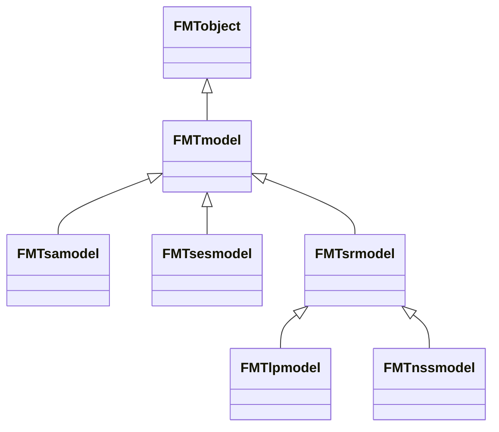

## Que sont les objets ?

FMT est fabriqué avec une structure particulière appelée *Programmation orientée objet* (POO). Si vous n'en avez jamais entendu parler, en voici un résumé très rapide pour mieux comprendre comment utiliser FMT.

Dans l'approche OOP, le programme utilise différents "objets" qui ont une certaine "classe" et qui peuvent avoir différentes "fonctions".

Vous connaissez et utilisez peut-être déjà des fonctions dans des logiciels tels que "R". Par exemple, dans R, `plot()` est une fonction.

Vous pourriez également être habitué.e à *certains* objets et classes dans le logiciel que vous utilisez. Par exemple, dans `R`, `data<-read.csv (données.csv)` met le contenu des `données.fichier csv` dans l'objet `data`, qui a la classe `data frame`.

Maintenant, imaginez que chaque fonction que vous utilisez est associée à un objet d'une classe particulière. Par exemple, une classe `chien` aurait la fonction `abboyer_sur()`. Si nous avons une classe nommée `chat`, nous pourrions alors :

- Créer un nouvel objet `chien` de la classe `chien` : `pluto = chien(nom = Pluto, age = 8)`
- Créer un nouvel objet `chat` à partir de la classe `chat` : `felix = chat(nom = Felix, age = 2)`
- Faire aboyer le chien sur le chat: `pluto.abboyer_sur(felix)`

À son tour, l'objet peut avoir des "propriétés", qui sont exactement ce à quoi cela ressemble. Par exemple, disons que notre classe `chat` a trois propriétés : `nom` (qui peut être une chaîne de caractères), `age` (qui peut être un nombre) et `effrayé` (qui est un booléen, `true` ou `false`).

Dans notre exemple précédent, avant d'utiliser `pluto.abboyer_sur(felix)`, la propriété `felix.peur` pouvait être `false`. Mais maintenant que nous avons utilisé `pluto.abboyer_sur(felix)`, `felix.effrayé` s'est surement changé en `true`.

Enfin, une *classe parent* en programmation orientée objet signifie que la *classe enfant* *héritera* automatiquement de toutes les fonctions et propriétés de la fonction parent.

Par exemple, supposons que nous ayons une classe parent `animal` dont dérivent les classes `chien` et `chat`. Si la classe `animal` a une fonction `respiration` (`animal.respiration()`), alors les classes `chien` et `chat` étant ses classes *enfant*, elles auront automatiquement cette fonction (`chien.respiration()`) et `chat.respiration()`).

La *programmation orientée objet* est une façon particulière de programmer, intégrée dans le langage de programmation que vous utilisez, qui présente de multiples avantages. L'un d'eux est de rendre les choses plus faciles à représenter.

**En bref** : FMT utilise la *programmation orientée objet*, ce qui fait de tout un objet avec des fonctions particulières. Les fonctions et propriétés d'un objet sont définies par sa classe.

Pour apprendre à utiliser FMT, vous apprendrez quelles sont ses classes principales, afin que vous puissiez créer les objets dont vous avez besoin et les faire interagir pour faire les choses que vous voulez faire. En effet, que ce soit en Python, R ou C ++, utiliser FMT signifie utiliser ses différents objets.

## Les *namespaces* de FMT

Les différentes classes d'objets dans FMT sont regroupées en *espaces de noms* (*namespaces*), qui sont simplement les différentes sections de ses fichiers.

Dans FMT, les différents *espaces de noms* sont :

- **`Parser`** : Contient des classes utilisées pour lire ou éditer les fichiers des modèles au format Woodstock
- **`Modèles`**: Contient des classes utilisées pour manipuler et résoudre les modèles
- **`Spatial`**: Contient des classes utilisées pour pour travailler sur des données spatialement explicites
- **`Heuristique`** : Contient les heuristiques utilisées pour agréger spatialement les blocs de coupe et les planifier dans le temps
- **`Version`**: Contient des informations sur la version actuelle de FMT, et les fonctions qu'elle contient (ce qui dépend de la façon dont il a été compilée)

{}
Si vous regardez l'[importation de FMT dans Python](../../download_install/importing_in_python /), vous verrez que nous importons les principaux espaces de noms dont vous aurez besoin en Python.
{}

## Classes importantes de l'espace de noms `Parser`

L'espace de noms `Parser` contient deux classes importantes pour la lecture des modèles :

- `FMTareaparser` : Permet la lecture et l'écriture des fichiers raster et vectoriels utilisés dans les opérations spatiales de FMT
	- Certaines de ses fonctions vous permettent de transformer des données entre le format vectoriel et le format raster.
- `FMTmodelparser` : Permet de lire les fichiers d'un modèle Woodstock avec la fonction `read project()`, ou de l'enregistrer avec la fonction `write()` après l'avoir modifié.
	- La classe utilise également d'autres classes faites pour lire les fichiers Woodstock.

## La classe `FMTmodel`

La classe `FMTmodel` est la base de FMT.

Elle contient des informations provenant des fichiers des modèles au format Woodstock. Cela peut être vu en [regardant les propriétés du `FMTmodel`](../../../../doxygen/html/classModels_1_1FMTmodel.html#pro-attribs) :



Cependant, ces attributs sont "protégés" afin qu'ils ne soient pas modifiés de manière incorrecte. Si vous souhaitez les lire lors de l'utilisation de FMT, vous devrez utiliser [les fonctions *getter*](../../../../doxygen/html/classModels_1_1FMTmodel.html#pub-methods) qui les obtiendront pour vous :



De plus, vous pouvez les modifier de la bonne manière en utilisant [les fonctions *setter*](../../../../doxygen/html/classModels_1_1FMTmodel.html#pub-methods). Cela vous permet d'éditer différentes parties du modèle.



En fin de compte, le `FMTModel` est ce que nous appelons une *classe parent* pour toutes les différentes classes de modèles utilisées par FMT, telles que `FMTlpmodel` (modèle de programmation linéaire) et `FMTsesmodel` (modèle spatialement explicite) selon le diagramme suivant :



Observez que toutes ces classes héritent finalement de la classe `FMTobject`. C'est le cas pour chaque objet de FMT, car `FMTobject` contient des fonctions et des propriétés utiles pour déboguer FMT.

Les modèles `FMTnssmodel` et `FMTlpmodel` sont des modèles référencés spatialement. Le `FMTlpmodel` est utilisé pour **l'optimisation**, tandis que `FMTnssmodel` est utilisé pour la **simulation**.

En contraste, les modèles `FMTsesmodel` et `FMTsamodel` sont des modèles spatialement explicites. De la même manière, `FMTsamodel` est utilisé pour **l'optimisation**, tandis que `FMTsesmodel` est utilisé pour la **simulation**.

**Nous examinerons de plus près les différents types de modèles plus tard. Pour l'instant, nous n'utiliserons que le modèle le plus simple qui correspond le plus à une structure de modèle de Woodstock, le `FMTlpmodel`.**

## Lire un simple `FMTlpmodel`

Voici un exemple qui permet de lire un modèle de programmation linéaire (au format Woodstock) avec FMT.

En R, le code pour correspondant serait :

```R
library(FMT) # Charge FMT dans R
if (new(FMTversion)$hasfeature("OSI")) # Vérifie si FMT a été compilé avec OSI en créant un nouvel objet FMTversion, et en utilisant la fonction hasfeature().
{
	# Créer un objet parser pour lire les fichiers du modèle
	newmodelparser <- new(FMTmodelparser)
	# Lit le projet avec le parser en spécifiant que l'on veut lire le scénario "LP" (il peut y avoir différents scénarios dans un seul modèle)
	modelslist <- newmodelparser$readproject("Models/TWD_land/TWD_land.pri", c("LP"), TRUE, TRUE, TRUE)
	model_scenario_lp <- modelslist[[1]]
	# On récupère le nom du modèle
	print(model_scen_lp$getname())
} else { # Si le modèle n'as pas été compilé avec OSI, on affiche une erreur
	print("FMT needs to be compiled with OSI")
}
```

Dans Python, le même code aurait la forme suivante :

```python
import sys
from FMT import Models
from FMT import Parser
from FMT import Version

if __name__ == "__main__":
	if Version.FMTversion().hasfeature("OSI"): # Vérifie si FMT a été compilé avec OSI en utilisant la fonction hasfeature() de la classe FMTversion.
		# Créer un objet parser pour lire les fichiers du modèle
		newmodelparser=  Parser.FMTmodelparser()
		path = "Models/TWD_Land/TWD_Land.pri"
		scenarios = ["LP"]
		# Lit le projet avec le parser en spécifiant que l'on veut lire le scénario "LP" (il peut y avoir différents scénarios dans un seul modèle)
		modelslist = newmodelparser.readproject(path, scenarios)
		model_scen_lp = modelslist[0]
		# On récupère le nom du modèle
		print(model_scen_lp.getname())
	else:
		# Si le modèle n'as pas été compilé avec OSI, on affiche une erreur
		print("FMT needs to be compiled with OSI")
```

Que ce soit dans le terminal de R ou de Python, les codes précédents devraient affichier la même chose :

```bash
Reading Models/TWD_land/TWD_land.pri
FMT 0.9.1, build: Sep 30 2021 12:07:49
Tue Oct 05 10:59:57 2021
Reading Scenario Lp
FMTexc(39)Undefined _death action: _DEATH FMTsection(4)Action
FMTexc(40)Undefined _death transition: _DEATH FMTsection(5)Transition
Done reading Tue Oct 05 10:59:57 2021
[1] "LP"
```

Comme on peut le voir, FMT indique qu'il a lu le scénario "LP", et il affiche son nom.

## L'espace de noms `Core`.

L'espace de nom `Core` contient les éléments utilisés par FMT "sous le capot" pour faire fonctionner l'objet `FMTModel`.

Par exemple, il contient les objets :

- `FMTaction` : Classe qui définit l'opérabilité de plusieurs strates pour une perturbation donnée.
- `FMTtransition` : Classe qui définit les transitions de strates multiples pour une perturbation donnée.
- `FMTyields` : Classe qui définit les valeurs de croissance et de rendement pour chaque strate.
- `FMToutputs` : Classe qui définit les sorties dans le modèle (inventaire ou action), mais pas les sorties *du* modèle (par exemple, les fichiers de sortie ou autres).
- `FMTconstraints` : Classe qui définit les contraintes globales et l'objectif du modèle (par exemple, la variable à optimiser).

Ces différents objets peuvent être appelés depuis un objet `FMTmodel` avec les différentes fonctions *getter*.

Par exemple, pour voir la liste des objets `FMTaction` associés à un `FMTmodel` particulier, vous pouvez utiliser la fonction `FMTModel.getactions()` (ou `FMTModel$getactions()` en R), et utiliser une boucle `for` pour afficher toutes les actions dans le modèle. **Les actions affichées de cette manière correspondront aux actions présentes dans le fichier `.act` des fichiers Woodstock pour le modèle**.

Voici un exemple qui affiche les actions et les transitions d'un `FMTmodel` en code R :

```R
library(FMT) # Charge FMT dans R
if (new(FMTversion)$hasfeature("OSI")) # Vérifie si FMT a été compilé avec OSI en créant un nouvel objet FMTversion, et en utilisant la fonction hasfeature().
{
	# Créer un objet parser pour lire les fichiers du modèle
	newmodelparser <- new(FMTmodelparser)
	# Lit le projet avec le parser en spécifiant que l'on veut lire le scénario "LP" (il peut y avoir différents scénarios dans un seul modèle)
	modelslist <- newmodelparser$readproject("Models/TWD_land/TWD_land.pri", c("LP"), TRUE, TRUE, TRUE)
	model <- modelslist[[1]]
	# Récupère le actions du modèle et les affiche
	print("***** Here is the name of the actions")
	for (action in model$getactions())
	{
		print(action$getname())
	}
	# On fait de même pour les transitions
	print("***** Here is the name of the transitions")
	for (transition in model$gettransitions())
	{
		# On concaténe l'entrée pour la transition afin de la rendre plus lisible dans le terminal
		cat(transition$str())
	}

} else { # Si le modèle n'as pas été compilé avec OSI, on affiche une erreur
	print("FMT needs to be compiled with OSI")
}
```

Ce code en R affichera le texte suivant dans le terminal :

```bash
Reading Models/TWD_land/TWD_land.pri
FMT 0.9.1, build: Sep 30 2021 12:07:49
Tue Oct 05 10:59:57 2021
Reading Scenario Lp
FMTexc(39)Undefined _death action: _DEATH FMTsection(4)Action
FMTexc(40)Undefined _death transition: _DEATH FMTsection(5)Transition
Done reading Tue Oct 05 10:59:57 2021
[1] "***** Here is the name of the actions"
[1] "CLEARCUT"
[1] "ACARIBOU"
[1] "PLANTATION"
[1] "AFIRE"
[1] "ARECUP"
[1] "_DEATH"
[1] "***** Here is the name of the transitions"
*CASE CLEARCUT
*SOURCE ? ? ?
*TARGET ? ? ? 100.000000
*CASE ACARIBOU
*SOURCE ? ? ?
*TARGET ? ? ? 100.000000 _LOCK 1
*CASE PLANTATION
*SOURCE ? ? ?
*TARGET ? STAND1 ? 100.000000
*CASE AFIRE
*SOURCE ? ? ?
*TARGET ? FIRE ? 100.000000
*CASE ARECUP
*SOURCE ? FIRE ?
*TARGET ? STAND1 ? 100.000000
*CASE _DEATH
*SOURCE ? ? ?
*TARGET ? ? ? 100.000000
```

L'équivalent en Python serait :

```python
import sys
from FMT import Models
from FMT import Parser
from FMT import Version

if __name__ == "__main__":
	if Version.FMTversion().hasfeature("OSI"):
		# Créer un objet parser pour lire les fichiers du modèle
		newmodelparser=  Parser.FMTmodelparser()
		path = "Models/TWD_Land/TWD_Land.pri"
		scenarios = ["LP"]
		# Lit le projet avec le parser en spécifiant que l'on veut lire le scénario "LP" (il peut y avoir différents scénarios dans un seul modèle)
		modelslist = newmodelparser.readproject(path, scenarios)
		model = modelslist[0]
		# Récupère le actions du modèle et les affiche
		print("***** Here is the name of the actions")
		for action in model.getactions():
			print(action)
		# On fait de même pour les transitions
		print("***** Here is the name of the transitions")
		for transition in model.gettransitions():
			print(transition.getname())
	else:
		print("FMT needs to be compiled with OSI")
```

Ce qui donnera le texte suivant dans le terminal Python. Notez que si les sorties entre R et Python devraient généralement être les mêmes, il existe parfois de petites différences. Ici, la version Python affichera plus d'informations sur les actions, et juste le nom des transitions par rapport à R ; ceci est dû aux particularités des deux langages.

```bash
Reading Models/TWD_land/TWD_land.pri
FMT 0.9.1, build: Sep 30 2021 12:07:49
Tue Oct 05 10:59:57 2021
Reading Scenario Lp
FMTexc(39)Undefined _death action: _DEATH FMTsection(4)Action
FMTexc(40)Undefined _death transition: _DEATH FMTsection(5)Transition
Done reading Tue Oct 05 10:59:57 2021
***** Here is the name of the actions
*ACTION CLEARCUT Y
*OPERABLE COUPETOTALE
? ? ? TOTALVOLUME >= 100.000000

*ACTION ACARIBOU N
*OPERABLE ACARIBOU
UC ? ? _AGE >= 8

*ACTION PLANTATION Y _LOCKEXEMPT
*OPERABLE PLANTATION
? ? ? _AGE >= 1 AND _AGE <= 3

*ACTION ARECUP Y
*OPERABLE AFIRE
? PROD ? _AGE >= 1

*ACTION ARECUP Y
*OPERABLE ARECUP
? FEU ? _AGE = 0

*ACTION _DEATH Y _LOCKEXEMPT
*OPERABLE _DEATH
? ? ? _AGE >= 80

***** Here is the name of the transitions
CLEARCUT
ACARIBOU
PLANTATION
AFIRE
ARECUP
_DEATH
```

## Comparer des éléments dans FMT

Une opération courante à faire dans vos scripts sera de comparer des éléments : par exemple, comparer le nom d'un objet `FMTaction` avec le nom de l'action que vous voulez sélectionner, etc.

Dans de tels cas, rappelez-vous que **toutes les chaînes de caractères lues par FMT sont automatiquement mises en majuscules**. Par conséquent, **si vous voulez comparer le nom des éléments dans FMT, assurez-vous que les lettres sont en majuscules**.

Par exemple, si vous avez une action nommée `Clearcut` ou `clearcut` que vous voulez sélectionner, vous devrez comparer le nom des `FMTactions` des modèles avec le mot `CLEARCUT`, tout en majuscules.

## Conversion des erreurs en avertissements

Toutes les classes FMT héritent de la classe `FMTobject`, et partagent donc les mêmes objets `FMTexceptionhandler` et `FMTlogger`.

Si l'utilisateur veut ignorer certaines erreurs, il peut utiliser la fonction `seterrorstowarnings` de n'importe quelle classe FMT et passer un vecteur d'erreurs que le gestionnaire d'erreurs doit considérer comme des avertissements. Cette fonction est hazardeuse et peux mener a des erreurs. Il est recommandé d'investiguer les messages d'erreur de FMT et de corriger les modèles conséquement. 

* * *

Maintenant que vous savez tout sur la structure de FMT et ses éléments de base, nous allons voir comment faire de l'optimisation à référence spatiale avec elle, qui est l'une des principales fonctions de FMT.